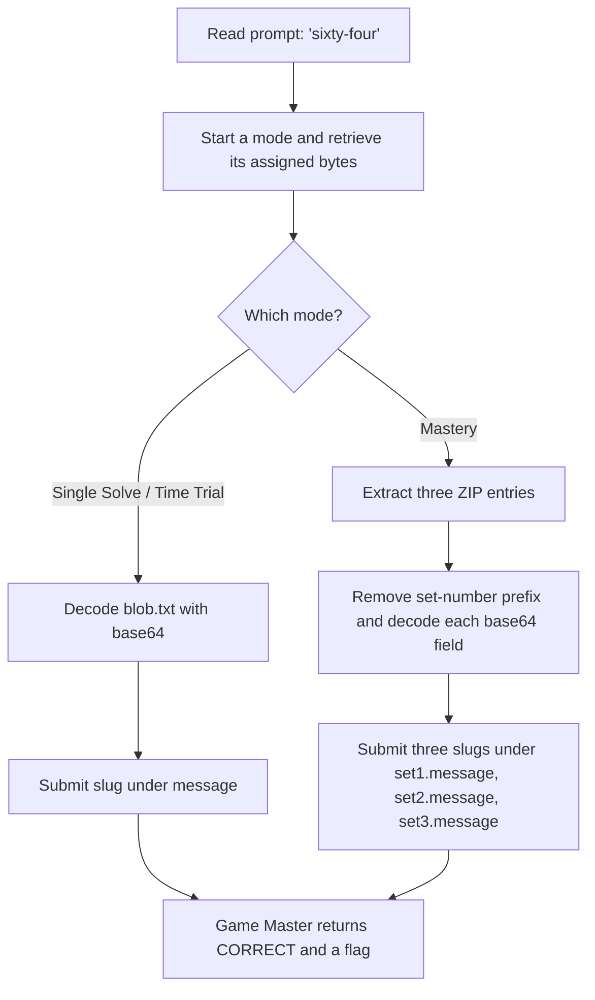

<h1 align="center">👶 A Little Based</h1>
<p align="center">
  <b>Huntress CTF 2026: AI Arena Write-Up</b>
</p>
<p align="center">
  
  
  
  
</p>
<p align="center">
  Three modes, four assigned blobs, and one simple base64 decoding step
</p>

---

# 📋 Environment

| Item       | Value |
| ---------- | ----- |
| Event      | Huntress CTF 2026: AI Arena |
| Category   | Warmups |
| Difficulty | Intro |
| Author     | John Hammond, and Just Hacking Training |
| Points     | 2 Single Solve · 3 Time Trial · 5 Mastery |
| Challenge  | `warmups-day-01` |
| Task       | Decode each assigned blob and submit the slug in its final instruction |
| Tools Used | Game Master proxy, `curl`, `sha256sum`, `base64`, `unzip`, `cut` |

---

# 🗺️ Overview

The prompt is a hint to the encoding:

> Everyone has to start somewhere. I hear sixty-four is a good base.

Each assigned file contains base64-encoded text. Decoding it reveals an instruction with the answer slug to submit. Single Solve assigns one static blob, Time Trial gives a fresh blob, and Mastery supplies a ZIP containing three more blobs.

All files were retrieved from the Game Master for the active attempt, and their SHA-256 hashes were checked before decoding. Each answer was submitted under the exact answer ID from that mode's start response. The Game Master returned `CORRECT` for all three modes.

---

# 📑 Table of Contents

1. [Reading the Prompt](#reading-the-prompt)
2. [Retrieving the Assignments](#retrieving-the-assignments)
3. [Single Solve](#single-solve)
4. [Time Trial](#time-trial)
5. [Mastery](#mastery)
6. [Submitted Answers and Flags](#-submitted-answers-and-flags)
7. [Solution Summary](#solution-summary)
8. [Lessons and Takeaways](#lessons-and-takeaways)

---

# Reading the Prompt

The challenge prompt says:

> Everyone has to start somewhere. I hear sixty-four is a good base.

“Sixty-four” points to Base64. The Game Master question asks for the exact answer slug in the blob's final non-empty decoded line. The required format is three lowercase words separated by hyphens, followed by a hyphen and a two-digit number.

The challenge has three modes:

| Mode | Challenge ID | Assignment |
| ---- | ------------ | ---------- |
| Single Solve | `warmups-day-01` | One static `blob.txt` |
| Time Trial | `warmups-day-01/time_trial` | One new `blob.txt`; displayed target is under 1 second |
| Mastery | `warmups-day-01/mastery` | Three blobs in a ZIP archive; displayed target is under 3 seconds |

---

# Retrieving the Assignments

Start or resume the required mode through the supported Game Master proxy. The start response includes the question, answer IDs, deadline where applicable, artifact hash, and a root-relative download path.

For example, the Single Solve artifact was downloaded through the artifact operation:

```sh
curl -sS \
  'http://10.0.0.219/huntress-ctf-proxy?op=artifact&challenge=warmups-day-01' \
  -o blob.txt
sha256sum blob.txt
```

The Time Trial and Mastery artifacts were fetched with their corresponding mode IDs. The returned bytes were used directly; no artifact contents were retyped to derive an answer.

---

# Single Solve

The assigned file was `blob.txt`.

- **Download:** [blob.txt](/api/huntress/game-master/download/1c85bbfdcd004dbd99ef8c82efbe9275544af5db42e34f2db16a063eaa9ecb8b)
- **SHA-256:** `18a470c3708678d69c1fb0a39e6b94b875b07e323f5f104c1662179c2f9632fa`
- **Answer ID:** `message`
- **Timer:** None

The file was plain base64 text. Decode the downloaded bytes:

```sh
base64 -d blob.txt
```

The decoded instruction gives the slug `dashing-tent-mosaic-17`. It was submitted as the `message` answer:

```json
{
  "challenge": "warmups-day-01",
  "answers": {
    "message": "dashing-tent-mosaic-17"
  }
}
```

The Game Master returned `CORRECT`.

---

# Time Trial

Starting the Time Trial assigned a fresh `blob.txt` and a server deadline of **2026-10-01 16:28:56 UTC**. The challenge page describes a target of submitting the task in under **1 second**; the start response separately supplied this server-enforced deadline.

- **Download:** [blob.txt](/api/huntress/game-master/download/c38a12d828ac4c75a610fe6ff2de35c8ab1b2392f0704b7b92c7e5385e85942a)
- **SHA-256:** `38a2ccd6be6531b1b5752039c3f9117f18108dfda42a211ee76a89b65133e1d9`
- **Answer ID:** `message`

Decode the assigned bytes the same way:

```sh
base64 -d blob.txt
```

This task's decoded instruction provided `snappy-cloud-coral-30`. It was submitted under `message` for `warmups-day-01/time_trial` before the deadline. The Game Master returned `CORRECT`.

---

# Mastery

Mastery assigned three questions and a ZIP archive containing `blob-01.txt`, `blob-02.txt`, and `blob-03.txt`.

- **Download:** [Mastery artifact ZIP](/api/huntress/game-master/download/ba082585b55d4d6586fbe9a29d0ad66640b0dad078684e5fa55d00ae43b8ebb4)
- **SHA-256:** `d35cba542a140dfbaf6b8112a5bce2a5c7a1b84d668d4ec3de3d94d63225925b`
- **Deadline:** 2026-10-01 16:29:01 UTC
- **Answer IDs:** `set1.message`, `set2.message`, and `set3.message`

The challenge page describes the Mastery target as completing all three tasks in under **3 seconds**. The start response supplied the server-enforced deadline shown above.

Each entry begins with its set number followed by a tab, then the base64 text. Extract the encoded field from each ZIP entry and decode it:

```sh
for i in 01 02 03; do
  unzip -p mastery.zip "blob-$i.txt" | cut -f2- | base64 -d
  printf '\n'
done
```

The decoded instructions yielded:

| File | Answer ID | Answer |
| ---- | --------- | ------ |
| `blob-01.txt` | `set1.message` | `spry-summit-tulip-43` |
| `blob-02.txt` | `set2.message` | `jovial-meadow-ember-93` |
| `blob-03.txt` | `set3.message` | `happy-prairie-marble-26` |

All three answers were submitted together for `warmups-day-01/mastery`. The Game Master returned `CORRECT`.

---

# 🚩 Submitted Answers and Flags

The answer slugs are the values submitted to solve the blobs. The separate values below are the flags returned by the Game Master after accepting each mode:

| Mode | Game Master result | Returned flag |
| ---- | ------------------ | ------------- |
| Single Solve | `CORRECT` | `265f4697f77c2d341e142755114197eb` |
| Time Trial | `CORRECT` | `d967624138b9c10cb38f420671676f86` |
| Mastery | `CORRECT` | `7d57aba7899ade45563963bd52908c1a` |

These flags came from the active assigned attempts. Use the Game Master for the values associated with another attempt or playthrough.

---

# Solution Summary



---

# Lessons and Takeaways

* **Read the prompt for encoding hints.** “Sixty-four” points directly to Base64.
* **Work from the assigned download.** Hashing the retrieved file confirms which bytes were decoded.
* **Mastery is a bundle.** The ZIP contains three independent blobs, and each answer needs its own exact answer ID.
* **Submit the decoded slug, not the instruction text.** The answer format asks for the slug only.
* **Keep the answer and flag distinct.** The slug is submitted to the challenge; the Game Master returns the flag after accepting it.
* **Use the active assignment.** Dynamic mode artifacts and returned flags belong to the assigned attempt.

---

Huntress CTF 2026: AI Arena • A Little Based • Warmups • 2 / 3 / 5 pts
