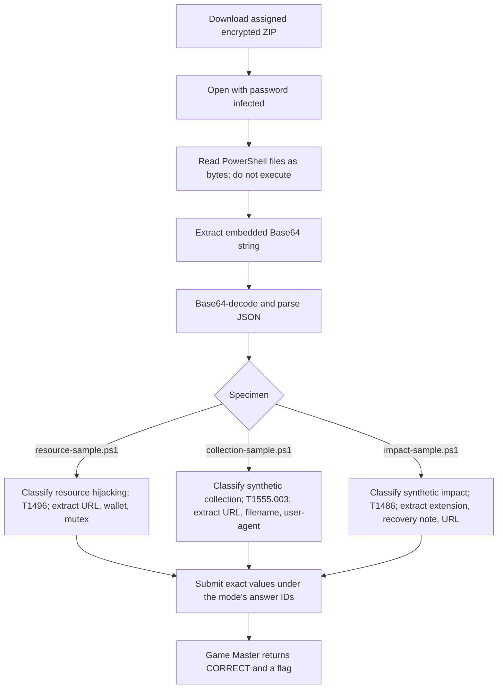

<h1 align="center">📜 Power Play</h1>
<p align="center">
  <b>Huntress CTF 2026: AI Arena Write-Up</b>
</p>
<p align="center">
  
  
  
  
</p>
<p align="center">
  Three inert PowerShell specimens, three ATT&amp;CK mappings, and plain-text indicators recovered without running a script
</p>

---

# 📋 Environment

| Item       | Value |
| ---------- | ----- |
| Event      | Huntress CTF 2026: AI Arena |
| Category   | Script Analysis |
| Difficulty | Intro |
| Author     | John Hammond, and Just Hacking Training |
| Points     | 2 Single Solve · 3 Time Trial · 5 Mastery |
| Challenge  | `script-analysis-day-01-native-signals` |
| Task       | Classify each specimen, map its primary ATT&CK technique, and extract exact indicators |
| Tools Used | Game Master proxy, `curl`, `pyzipper`, Python `base64`, `json`, `re`, `hashlib` |

---

# 🗺️ Overview

The prompt says:

> Three PowerShell specimens are on the table, and none of them will ever run. That's fine, because you only need to read them. Classify each script's intent, map its primary ATT&CK technique, and pull out the exact indicators sitting in plain sight.

Each archive contains PowerShell text with Base64-encoded JSON records. The records hold the indicators needed by the questions. The scripts were inspected as data: no PowerShell code was executed.

The three specimen types and accepted primary technique IDs are:

| Specimen | Scenario | Primary ATT&CK technique |
| -------- | -------- | ------------------------ |
| `resource-sample.ps1` | `resource_hijacking` | T1496 — Resource Hijacking |
| `collection-sample.ps1` | `synthetic_collection` | T1555.003 — Credentials from Web Browsers |
| `impact-sample.ps1` | `synthetic_impact` | T1486 — Data Encrypted for Impact |

Single Solve and Time Trial each assign one archive with three specimens. Mastery assigns two new evidence ZIPs, each containing all three specimen types. The Game Master returned `CORRECT` for all three modes.

---

# 📑 Table of Contents

1. [Reading the Prompt](#reading-the-prompt)
2. [Retrieving and Inspecting the Assignments](#retrieving-and-inspecting-the-assignments)
3. [Single Solve](#single-solve)
4. [Time Trial](#time-trial)
5. [Mastery](#mastery)
6. [Submitted Answers and Flags](#-submitted-answers-and-flags)
7. [Solution Summary](#solution-summary)
8. [Lessons and Takeaways](#lessons-and-takeaways)

---

# Reading the Prompt

The instructions explicitly say the PowerShell specimens will not be run. That leaves static analysis as the intended path. The scripts decode a Base64 string, parse the resulting JSON, then assemble a record. Extracting and decoding that data is enough to answer the questions.

The resource sample includes a wallet, a URL, a registry Run key, and a named mutex. The collection sample identifies browser data such as `Login Data` and `Cookies`, along with an upload URL and user-agent. The impact sample includes a locked-file extension, a recovery-note filename, and a URL. These clues support the scenario labels and ATT&amp;CK mappings shown above.

| Mode | Challenge ID | Assignment |
| ---- | ------------ | ---------- |
| Single Solve | `script-analysis-day-01-native-signals` | One `evidence.zip` with three PowerShell specimens |
| Time Trial | `script-analysis-day-01-native-signals/time_trial` | A fresh `evidence.zip` with three new specimens |
| Mastery | `script-analysis-day-01-native-signals/mastery` | Two evidence ZIPs, each containing three new specimens |

The challenge page specifies a Time Trial target of **one task under 8 seconds** and a Mastery target of **two tasks under 7 seconds**. The start responses supplied server deadlines of **2026-10-01 16:39:35 UTC** and **2026-10-01 16:39:58 UTC**, respectively. The Game Master accepted both submissions before their deadlines.

---

# Retrieving and Inspecting the Assignments

Start or resume each mode through the supported proxy, then use the artifact operation with that mode's challenge ID. For example:

```sh
curl -sS \
  'http://10.0.0.219/huntress-ctf-proxy?op=artifact&challenge=script-analysis-day-01-native-signals' \
  -o evidence.zip
```

The ZIP password supplied by the challenge page is `infected`. These archives use AES ZIP encryption; `pyzipper` can read them and expose each script as bytes:

```python
import pyzipper

with pyzipper.AESZipFile("evidence.zip") as archive:
    archive.pwd = b"infected"
    for name in archive.namelist():
        script_bytes = archive.read(name)
        print(name, len(script_bytes))
```

The embedded Base64 record can be decoded without evaluating any PowerShell:

```python
import base64
import json
import re

match = re.search(rb"FromBase64String\('([^']+)'\)", script_bytes)
record = json.loads(base64.b64decode(match.group(1)))
print(record)
```

Mastery adds an outer ZIP containing two password-protected evidence ZIPs. Read each nested archive with the same password, then decode the scripts inside.

---

# Single Solve

The assigned `evidence.zip` was **2,465 bytes** and contained `resource-sample.ps1`, `collection-sample.ps1`, and `impact-sample.ps1`.

- **Download:** [evidence.zip](/api/huntress/game-master/download/91859efee1be45c7be0f0344571c009ac22e668db4a84084946fc5a64e12c8b3)
- **Archive SHA-256:** `07e61f33b72ae646d925087de9b9e94068812fdf12f7e43613d0b2bef6f6d3e5`
- **Timer:** None

The three script byte hashes and submitted answers were:

| Specimen | SHA-256 | Answer IDs and submitted values |
| -------- | ------- | ------------------------------- |
| `resource-sample.ps1` | `ea8e9bcd29204aee1ba9dc8a3b6c89d94ed906f56103bcd1f4810596c2cf0d39` | `resource-scenario` → `resource_hijacking`; `resource-attack` → `T1496`; `resource-url` → `https://cdn-03ce326948.example.invalid/3e59094b24e2.bin`; `resource-wallet` → `wallet_d327bc1114a907589af81bba71226b77`; `resource-mutex` → `Global\HuntressLab_6460b4f6aa72` |
| `collection-sample.ps1` | `aad21d27fe12ac5144b9d5af74c1891918614aee7d9f0e647ca73b84b0d4be7d` | `collection-scenario` → `synthetic_collection`; `collection-attack` → `T1555.003`; `collection-url` → `https://497b6b9b43.example.invalid/3f890532dd42.dat`; `collection-file` → `update-497b6b9b43.dat`; `collection-user-agent` → `Mozilla/5.0 HuntressLab/3.3` |
| `impact-sample.ps1` | `fe190c23df4e86ae1805d9cb489cfd0ebd51bbf87f42a0eefe30377cbb2c53d4` | `impact-scenario` → `synthetic_impact`; `impact-attack` → `T1486`; `impact-extension` → `.locked-1d685`; `impact-note` → `RECOVERY-1d6858b777.txt`; `impact-url` → `https://1d6858b777.example.invalid/a0e20204ed17.dat` |

The Game Master returned `CORRECT`.

---

# Time Trial

The Time Trial assigned a fresh `evidence.zip` of **2,472 bytes**, containing three new specimens.

- **Download:** [evidence.zip](/api/huntress/game-master/download/5c813f9e003a4b66a50d6496ee0a31bf812d1278d3dd42028734634ee469fe94)
- **Archive SHA-256:** `76980d6a5ad47ff42da017569278ceaf77bc9f226090bd5fa5d947c3caf5480e`
- **Server deadline:** 2026-10-01 16:39:35 UTC
- **Displayed target:** One task under 8 seconds

The extracted specimen hashes and submitted answers were:

| Specimen | SHA-256 | Answer IDs and submitted values |
| -------- | ------- | ------------------------------- |
| `resource-sample.ps1` | `79207792878b1c9dbb52a22fb38df1206a58e0998f454ac7a30f28c4647afb45` | `resource-scenario` → `resource_hijacking`; `resource-attack` → `T1496`; `resource-url` → `https://cdn-0f6d513fbb.example.invalid/b63d69cd4053.bin`; `resource-wallet` → `wallet_0c38618ac35dc2fdd25be1b3e6594d4d`; `resource-mutex` → `Global\HuntressLab_eda3c764cddf` |
| `collection-sample.ps1` | `80bb854a90c98f4da2638073ab5d26a020f9e91d4e2cbc4d38741ad2e2017fc9` | `collection-scenario` → `synthetic_collection`; `collection-attack` → `T1555.003`; `collection-url` → `https://cdn-10c2bc67b8.example.invalid/cb2dfc203cd6.bin`; `collection-file` → `update-10c2bc67b8.dat`; `collection-user-agent` → `Mozilla/5.0 HuntressLab/6.4` |
| `impact-sample.ps1` | `9db3099ced069f68ccbdc3dddf65376e2f0c4dcc4909360a830bc6ed14dfe0f7` | `impact-scenario` → `synthetic_impact`; `impact-attack` → `T1486`; `impact-extension` → `.locked-636db`; `impact-note` → `RECOVERY-636dba9789.txt`; `impact-url` → `https://636dba9789.example.invalid/ae0cca3418e0.dat` |

The answers were submitted under the same 15 answer IDs as Single Solve. The Game Master returned `CORRECT` before the server deadline.

---

# Mastery

Mastery assigned a **5,166-byte** bundle containing `evidence-01.zip` and `evidence-02.zip`. Each nested archive held one new resource sample, collection sample, and impact sample.

- **Download:** [script-analysis-day-01-native-signals-mastery.zip](/api/huntress/game-master/download/34769541a0b84d0688e4592e1a137f405770dc5983ff4892b3a3ccdb5c5e26b8)
- **Bundle SHA-256:** `f96ad10b598a63dc897fd8890dd7de8cbbd9cbc1717d3f72627484d057b1b2cd`
- **Server deadline:** 2026-10-01 16:39:58 UTC
- **Displayed target:** Two tasks under 7 seconds

The nested archives were:

| Nested archive | SHA-256 |
| -------------- | ------- |
| `evidence-01.zip` | `6e56b9cd1f556df6bc06625e49c6b44a558038f860083b9b6bf361f220bdabee` |
| `evidence-02.zip` | `138b9694cb389e7372c1a441efb6a7afc4dfc85166e41eb289b6ad85170f0962` |

Each answer ID is prefixed by its set number. The extracted script hashes and all 30 submitted answers were:

| Set | Specimen | SHA-256 | Answer IDs and submitted values |
| --- | -------- | ------- | ------------------------------- |
| 1 | `resource-sample.ps1` | `5e68e5971c625bbf605b75ccbef6c86a4f6f00c6c61edaf7822b0813317d0eba` | `set1.resource-scenario` → `resource_hijacking`; `set1.resource-attack` → `T1496`; `set1.resource-url` → `https://cdn-4475cd197f.example.invalid/e07e909e50f9.bin`; `set1.resource-wallet` → `wallet_236a334438e02c20e6f85f31c797f1e7`; `set1.resource-mutex` → `Global\HuntressLab_2d786793df1e` |
| 1 | `collection-sample.ps1` | `9004f3f46dbf12f6aeac27cb4109883f42b8e9ac6fca513a7a829ffa2f560205` | `set1.collection-scenario` → `synthetic_collection`; `set1.collection-attack` → `T1555.003`; `set1.collection-url` → `https://c8c06c19da.example.invalid/1e615eae3dec.dat`; `set1.collection-file` → `update-c8c06c19da.dat`; `set1.collection-user-agent` → `Mozilla/5.0 HuntressLab/0.2` |
| 1 | `impact-sample.ps1` | `72bd3e8f407c414bf571b9087fb5c9b4d5b39803c4a50a6c30cf0a56dbe022fb` | `set1.impact-scenario` → `synthetic_impact`; `set1.impact-attack` → `T1486`; `set1.impact-extension` → `.locked-f6947`; `set1.impact-note` → `RECOVERY-f694785289.txt`; `set1.impact-url` → `https://f694785289.example.invalid/e29f24127092.dat` |
| 2 | `resource-sample.ps1` | `c7b7e9450222834309e1c26f6bd246825f2141e6431fc092fff0086a9ec578e3` | `set2.resource-scenario` → `resource_hijacking`; `set2.resource-attack` → `T1496`; `set2.resource-url` → `https://7d42284377.example.invalid/39d3f5063686.dat`; `set2.resource-wallet` → `wallet_fb6baf196fece8fa11114ba46428a02e`; `set2.resource-mutex` → `Global\HuntressLab_6f4a81be254d` |
| 2 | `collection-sample.ps1` | `ca96b6aa10038a40cd4610946c8b2b87e2707ec01bb035c6e968e1e1d0b615b5` | `set2.collection-scenario` → `synthetic_collection`; `set2.collection-attack` → `T1555.003`; `set2.collection-url` → `https://f1cd55b254.example.invalid/596004c450ef.dat`; `set2.collection-file` → `update-f1cd55b254.dat`; `set2.collection-user-agent` → `Mozilla/5.0 HuntressLab/1.5` |
| 2 | `impact-sample.ps1` | `81797234f810ca0d5c1721ea0eb3d282cf2f6e7137912e70abc28767912ba287` | `set2.impact-scenario` → `synthetic_impact`; `set2.impact-attack` → `T1486`; `set2.impact-extension` → `.locked-c2726`; `set2.impact-note` → `RECOVERY-c272690ae1.txt`; `set2.impact-url` → `https://c272690ae1.example.invalid/c1d3bd7f1efa.dat` |

All answers were submitted together. The Game Master returned `CORRECT` before the server deadline.

---

# 🚩 Submitted Answers and Flags

The scenario labels, ATT&amp;CK IDs, and indicators above were the submitted answers. The following separate flags were returned for the accepted attempts:

| Mode | Game Master result | Returned flag |
| ---- | ------------------ | ------------- |
| Single Solve | `CORRECT` | `2e5139b7e76f46518421c13c9772978d` |
| Time Trial | `CORRECT` | `d8581aff16129667f29f961b86ece18b` |
| Mastery | `CORRECT` | `ef11d357181d292410b31f5fbfdf834d` |

---

# Solution Summary



---

# Lessons and Takeaways

* **Treat scripts as data when the task calls for static analysis.** Reading the PowerShell text and decoding its Base64 record supplied everything needed.
* **An encoded string is not the same as executed code.** Base64-decoding it and parsing JSON does not require invoking the script.
* **Classify intent from the surrounding indicators.** The wallet and registry Run key support resource hijacking; browser files point to browser credential collection; a locked extension and recovery note point to impact through encryption.
* **Use exact values and exact answer IDs.** The URLs, filenames, mutexes, and indicators are attempt-specific.
* **Mastery contains separate fresh sets.** Prefix each answer with the set number and keep the two evidence archives' indicators separate.
* **Keep submitted answers distinct from returned flags.** The Game Master validates the answers and returns a mode-specific flag.

---

Huntress CTF 2026: AI Arena • Power Play • Script Analysis • 2 / 3 / 5 pts
