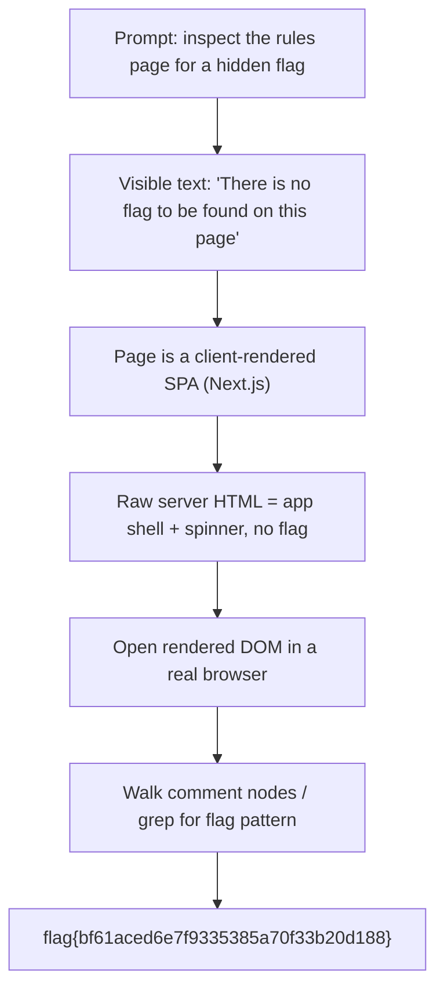

<h1 align="center">📖 Read the Rules</h1>
<p align="center">
  <b>Huntress CTF 2026: AI Arena Write-Up</b>
</p>
<p align="center">
  
  
  
  
</p>
<p align="center">
  A flag hiding in an HTML comment, revealed only after the page's JavaScript renders
</p>

---

# 📋 Environment

| Item       | Value                                                                 |
| ---------- | --------------------------------------------------------------------- |
| Event      | Huntress CTF 2026: AI Arena                                           |
| Category   | Information                                                           |
| Difficulty | Intro                                                                 |
| Author     | John Hammond, and Just Hacking Training                              |
| Points     | 10                                                                    |
| Target     | `https://ctf.huntress.com/rules`                                      |
| Task       | Inspect the rules page and find the flag left for a curious reader    |
| Tools Used | Web browser, DevTools / view-source, a little JavaScript             |

---

# 🗺️ Overview

> The challenge prompt asks you to read the rules at `https://ctf.huntress.com/rules` and "inspect the page carefully for a flag waiting for a curious hacker reader." The visible rules text is a bit of misdirection: it states outright that "There is no flag to be found on this page." The flag is real, but it is not rendered text. It lives in an HTML comment, and that comment is injected by the page's client-side JavaScript. A plain fetch of the server's HTML does not contain it; the comment only appears once the single-page app hydrates in a real browser. Opening the live, rendered DOM and scanning its comment nodes exposes the flag immediately.

Steps:
* Open the rules page and read the visible text (note the "no flag here" misdirection)
* Recognize the page is a client-rendered single-page app (Next.js)
* Inspect the **rendered** DOM rather than the raw server response
* Search the live DOM's comment nodes for the flag pattern

---

# 📑 Table of Contents

1. [Reading the Prompt](#reading-the-prompt)
2. [The Misdirection](#the-misdirection)
3. [Why the Raw HTML Looks Empty](#why-the-raw-html-looks-empty)
4. [Inspecting the Rendered DOM](#inspecting-the-rendered-dom)
5. [Flag](#-flag)
6. [Solution Summary](#solution-summary)
7. [Lessons and Takeaways](#lessons-and-takeaways)

---

# Reading the Prompt

The challenge sits in the **Information** category and is worth 10 points. The prompt is short:

> Read the rules at `https://ctf.huntress.com/rules`, inspect the page carefully for a flag waiting for a curious hacker reader. Find it and submit it below.

Two words do the heavy lifting: *inspect* and *curious*. In CTF parlance, "inspect the page" is a nudge toward the browser's developer tools and the page source rather than the text a casual visitor reads.

The flag format for the event is also worth noting, because the rules page spells it out:

> This year, we are using dynamic flag values unique to each team. Flags for this competition will follow the format of an MD5 hash: `[0-9a-f]{32}`.

So the value we are hunting for is a 32-character hex string (optionally wrapped as `flag{...}`).

---

# The Misdirection

The rendered rules text contains a deliberately misleading sentence:

> There is no flag to be found on this page, but we might ask you to confirm you've read and accept the rules within the game environment 😜

Taken at face value, this tells you to give up and move on. The winking emoji is the tell. The "no flag" claim refers only to the *visible* content. The flag is on the page; it is just not where your eyes land.

---

# Why the Raw HTML Looks Empty

The rules page is a client-rendered single-page application (built on Next.js). If you grab the server's response directly, for example with a simple HTTP fetch, you get the app shell: `<head>` metadata, a bundle of `<script>` tags, a loading spinner, and a `__NEXT_DATA__` JSON blob. The actual rules content, and the hidden comment, are **not** in that payload. They are produced in the browser when the JavaScript runs.

```html
<body>
  <div id="__next">
    <div class="flex flex-col items-center justify-center absolute inset-0">
      <svg class="h-5 w-5 animate-spin ..."> ... </svg>   <!-- just a spinner -->
    </div>
  </div>
  <script id="__NEXT_DATA__" type="application/json"> ... </script>
</body>
```

This is the key insight: a `curl`-style look at the page will convince you the "no flag" line is true. You have to inspect the page **after** it renders.

---

# Inspecting the Rendered DOM

Open the page in a browser, let it fully load, then look at the live DOM. View Source shows the pre-render payload, but DevTools' **Elements** panel (or **Inspect**) shows the hydrated page. The flag is tucked into an HTML comment, so it never displays on screen.

The fastest way to confirm it is to walk the document's comment nodes from the console. The snippet below gives the JavaScript the moment to render, then collects every comment node and any `flag{...}` pattern anywhere in the DOM:

```javascript
// Give the SPA a moment to hydrate, then scan the rendered DOM.
await new Promise(r => setTimeout(r, 3000));

// Pull every HTML comment out of the live document.
const comments = [];
const walker = document.createTreeWalker(document, NodeFilter.SHOW_COMMENT);
while (walker.nextNode()) comments.push(walker.currentNode.nodeValue.trim());

// Also grep the whole serialized DOM for the flag pattern.
const flags = document.documentElement.outerHTML.match(/flag\{[^}]*\}/gi);

console.log({ comments, flags });
```

Output:

```text
{
  comments: [ "flag{bf61aced6e7f9335385a70f33b20d188}" ],
  flags:    [ "flag{bf61aced6e7f9335385a70f33b20d188}" ]
}
```

There it is: a single HTML comment carrying the flag, exactly matching the `flag{` + 32-hex-char format the rules described.

> **In plain terms:** the page tells you there is no flag, but that only covers what you can read. The flag is written into an HTML comment by the page's JavaScript, so it shows up only once you look at the rendered DOM, not the raw server response.

---

# 🚩 Flag

```text
flag{bf61aced6e7f9335385a70f33b20d188}
```

> **Note:** Flag values for this event are dynamic and unique per team, so the exact hash above is specific to this session. If the submit box rejects the wrapped form, submit just the inner 32-character hash: `bf61aced6e7f9335385a70f33b20d188`. Per the challenge note, flags for **all future** challenges must come from the Game Master. This intro challenge is the one you find by hand.

---

# Solution Summary



---

# Lessons and Takeaways

* **"Inspect the page" means the rendered DOM, not just View Source.** On a client-rendered app, the HTML the server sends and the HTML the browser builds are different documents. The flag lived only in the second one.
* **Read misdirection as a signal.** "There is no flag on this page 😜" was the loudest hint in the challenge. The wink marks it as a claim about *visible* content only.
* **Comments are a classic hiding spot.** HTML comments render nowhere on screen but sit in plain sight in the DOM. A quick `TreeWalker` over `SHOW_COMMENT` nodes surfaces them instantly.
* **Know the flag format before you search.** The rules defined the flag as a 32-char MD5-style hash, which makes a regex sweep (`flag\{[0-9a-f]{32}\}`) fast and unambiguous.
* **Flags are dynamic this year.** Values are per-team, so a hardcoded hash from someone else's write-up will not score for you. The method transfers, the value does not.

---

Written by **TheDingo8MyBaby**
Huntress CTF 2026: AI Arena • Read the Rules • Information • 10 pts
