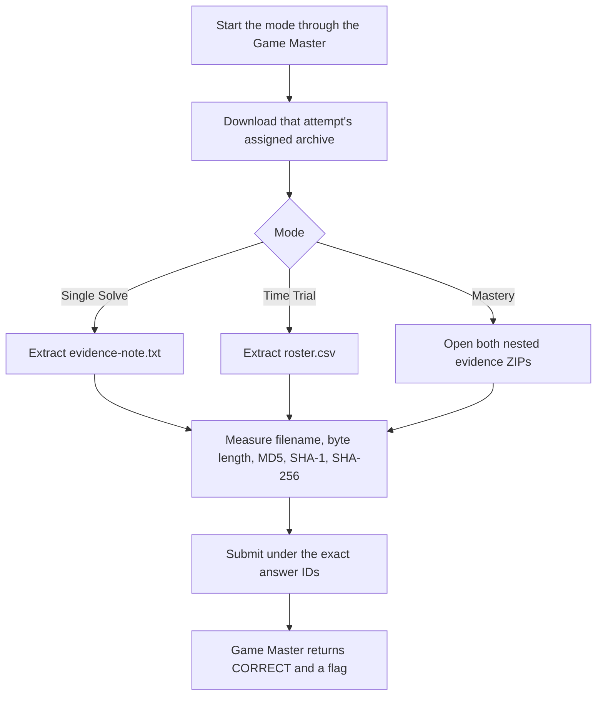

<h1 align="center">🔎 You Must Be This Hash to Ride</h1>
<p align="center">
  <b>Huntress CTF 2026: AI Arena Write-Up</b>
</p>
<p align="center">
  
  
  
  
</p>
<p align="center">
  Three modes, four evidence files, and hashes calculated from the assigned bytes
</p>

---

# 📋 Environment

| Item       | Value |
| ---------- | ----- |
| Event      | Huntress CTF 2026: AI Arena |
| Category   | Metadata Forensics |
| Difficulty | Intro |
| Author     | John Hammond, and Just Hacking Training |
| Points     | 2 Single Solve · 3 Time Trial · Mastery points not shown in the challenge panel |
| Challenge  | `metadata-forensics-day-01-hash-to-ride` |
| Task       | Identify assigned files by filename, byte length, and cryptographic digests |
| Tools Used | Game Master proxy, `curl`, Python `zipfile`, Python `hashlib` |

---

# 🗺️ Overview

The challenge prompt says:

> Three ordinary files arrived without trustworthy labels. Build an identity inventory from the bytes themselves and prove which labels can—and cannot—be trusted.

Each mode supplied an archive with a file to identify. The questions requested the file's exact base filename, size in bytes, MD5, SHA-1, and SHA-256. Mastery bundled two separate evidence sets, including a renamed copy.

All values below were calculated from the downloaded archive entries, not from retyped artifact contents. Answers were submitted under the exact answer IDs from each mode's start response. The Game Master returned `CORRECT` for all three modes.

---

# 📑 Table of Contents

1. [Reading the Prompt](#reading-the-prompt)
2. [Retrieving the Assignments](#retrieving-the-assignments)
3. [Single Solve](#single-solve)
4. [Time Trial](#time-trial)
5. [Mastery](#mastery)
6. [Submitted Answers and Flags](#-submitted-answers-and-flags)
7. [Solution Summary](#solution-summary)
8. [Lessons and Takeaways](#lessons-and-takeaways)

---

# Reading the Prompt

The prompt asks for an identity inventory “from the bytes themselves.” The Game Master made that concrete with exact filename, size, and digest questions. A filename alone is not enough to identify a file; measuring the extracted bytes supplies the other evidence.

| Mode | Challenge ID | Assignment |
| ---- | ------------ | ---------- |
| Single Solve | `metadata-forensics-day-01-hash-to-ride` | One evidence ZIP containing `evidence-note.txt` |
| Time Trial | `metadata-forensics-day-01-hash-to-ride/time_trial` | A fresh evidence ZIP containing `roster.csv` |
| Mastery | `metadata-forensics-day-01-hash-to-ride/mastery` | A ZIP bundle with two evidence ZIPs and two questions |

The challenge panel describes Time Trial as one dynamic task under **4 seconds** and Mastery as two dynamic tasks under **2 seconds**. Each start response also supplied a server deadline. The Time Trial deadline was **2026-10-01 16:33:28 UTC** and the Mastery deadline was **2026-10-01 16:33:35 UTC**. Both were accepted by the Game Master before their respective deadlines.

---

# Retrieving the Assignments

Start the mode through the supported proxy, then retrieve its assigned artifact. For example, the Single Solve archive was downloaded with:

```sh
curl -sS \
  'http://10.0.0.219/huntress-ctf-proxy?op=artifact&challenge=metadata-forensics-day-01-hash-to-ride' \
  -o metadata-day-01-evidence.zip
```

Use the corresponding mode ID for Time Trial or Mastery. To inspect a file and calculate its size and digests directly from an archive:

```python
import hashlib
import zipfile

with zipfile.ZipFile("metadata-day-01-evidence.zip") as archive:
    filename = "evidence-note.txt"
    data = archive.read(filename)

print("filename:", filename)
print("size:", len(data))
for algorithm in ("md5", "sha1", "sha256"):
    print(algorithm, hashlib.new(algorithm, data).hexdigest())
```

For the Mastery bundle, open the outer ZIP, then each assigned ZIP inside it and hash the named file's extracted bytes. This preserves the distinction between the bundle hash, each nested archive hash, and the evidence file hash.

---

# Single Solve

The assigned archive was `metadata-day-01-evidence.zip`; it contained `evidence-note.txt`.

- **Download:** [metadata-day-01-evidence.zip](/api/huntress/game-master/download/d313dbd49ab648809176f82e24426b4b9646ec156c9040cfba893c6be1ac4888)
- **Archive SHA-256:** `a511416df9e58c2a85f93a35a3c342c6cf8e03abc10d4b8eef1483394a5b64e5`
- **Answer IDs:** `evidence-note-filename`, `evidence-note-size-bytes`, `evidence-note-md5`, `evidence-note-sha1`, `evidence-note-sha256`
- **Timer:** None

The five answers submitted for the extracted file were:

| Answer ID | Answer |
| --------- | ------ |
| `evidence-note-filename` | `evidence-note.txt` |
| `evidence-note-size-bytes` | `240` |
| `evidence-note-md5` | `6b5074cd2b741ee5d0f0f9cae5eba7d5` |
| `evidence-note-sha1` | `11f594f647b3c81bce2527c0d9f6c72a60f492d9` |
| `evidence-note-sha256` | `a6d2d239a6ba996a16ea585c9dd5874b9a0fcdb1e16e3f10457d5ea79e944dc6` |

The Game Master returned `CORRECT`.

---

# Time Trial

The Time Trial assigned a fresh `metadata-day-01-evidence.zip`. The ZIP contained `roster.csv`.

- **Download:** [metadata-day-01-evidence.zip](/api/huntress/game-master/download/2ca89e7e692944e58b899a3165b0f937d6f270b98b7948578d22cf480753684a)
- **Archive SHA-256:** `f075726ccf34543ce70e213e09d77a879db21818bd83d2b97f09796262729641`
- **Answer IDs:** `roster-filename`, `roster-size-bytes`, `roster-md5`, `roster-sha1`, `roster-sha256`
- **Server deadline:** 2026-10-01 16:33:28 UTC
- **Displayed target:** One task under 4 seconds

The measurements from `roster.csv` were submitted as:

| Answer ID | Answer |
| --------- | ------ |
| `roster-filename` | `roster.csv` |
| `roster-size-bytes` | `129` |
| `roster-md5` | `d1d7be11e75a431dfefca861b5e107e3` |
| `roster-sha1` | `0bd2a514b4fcd79d627e3346a9cb44c05dd2b14c` |
| `roster-sha256` | `ca8713b5e6bbfe97aa7afe911dcf448f14fafb3507d89525dbb4a9f818eef887` |

The Game Master returned `CORRECT` before the server deadline.

---

# Mastery

Mastery assigned two evidence sets in one ZIP bundle. The first nested ZIP contained the renamed `evidence-note-copy.txt`; the second contained `evidence-note.txt`. Both files were 240 bytes, but their contents and digests differed.

- **Download:** [Mastery artifact ZIP](/api/huntress/game-master/download/03e7a0e7ec19411986d008fb89cabda18e050d6b02054f5994a832295d801446)
- **Bundle SHA-256:** `f699011b634a3f8f1aafe85b049f6f0a7895a49266a228a4578680bbfa982bf1`
- **Server deadline:** 2026-10-01 16:33:35 UTC
- **Displayed target:** Two tasks under 2 seconds

The bundle contained:

| Nested archive | Nested archive SHA-256 | Evidence file | Evidence file SHA-256 |
| -------------- | ---------------------- | ------------- | --------------------- |
| `metadata-day-01-evidence-01.zip` | `79cf2859918c218129925c27b9d64b3e204baf439f34ce451a4965a980124323` | `evidence-note-copy.txt` | `2515da19753771d2c76b32994713bdb3fabc0a1253bd297c54a2f78a1f27fa6a` |
| `metadata-day-01-evidence-02.zip` | `7807567eab3306f8712c774f91ae0fb0c508d187eb848a37330e9df9b0b2e9f4` | `evidence-note.txt` | `ff2aee2df86d89c26f1e3ca605477592ba9e0541856d62b9d35fa61b6166534f` |

The answers for both sets were submitted together:

| Answer ID | Answer |
| --------- | ------ |
| `set1.evidence-note-copy-filename` | `evidence-note-copy.txt` |
| `set1.evidence-note-copy-size-bytes` | `240` |
| `set1.evidence-note-copy-md5` | `f1080bdd43fe8cc7008ce3fbc5aeaaf9` |
| `set1.evidence-note-copy-sha1` | `668755f34a696d77c238f0b009e2081b0c35258f` |
| `set1.evidence-note-copy-sha256` | `2515da19753771d2c76b32994713bdb3fabc0a1253bd297c54a2f78a1f27fa6a` |
| `set2.evidence-note-filename` | `evidence-note.txt` |
| `set2.evidence-note-size-bytes` | `240` |
| `set2.evidence-note-md5` | `47de8dcf3e7864316ec2d256de080473` |
| `set2.evidence-note-sha1` | `80c4060bdbe9be855415094b77f02c90868840eb` |
| `set2.evidence-note-sha256` | `ff2aee2df86d89c26f1e3ca605477592ba9e0541856d62b9d35fa61b6166534f` |

The Game Master returned `CORRECT` before the server deadline.

---

# 🚩 Submitted Answers and Flags

The filename, size, and digest values above were the submitted answers. The separate flags below were returned by the Game Master after it accepted each mode:

| Mode | Game Master result | Returned flag |
| ---- | ------------------ | ------------- |
| Single Solve | `CORRECT` | `51a27852870b216421fdec7ed4a63a43` |
| Time Trial | `CORRECT` | `219e49ba819458e0f93f73dfdc7eb033` |
| Mastery | `CORRECT` | `a60e7011879af99227183b45cdddc5eb` |

---

# Solution Summary



---

# Lessons and Takeaways

* **Hash the extracted file bytes.** The ZIP archive digest identifies the package; the requested digests identify the file inside it.
* **Use the exact filename and answer ID.** Mastery distinguishes the renamed copy from the second evidence note through both its set-specific ID and its filename.
* **A matching size does not mean matching contents.** The two Mastery files were both 240 bytes, but their cryptographic digests differed.
* **Keep archive and file hashes separate.** Mastery has an outer bundle, nested evidence ZIPs, and extracted files, each with its own SHA-256.
* **Submit from the active assignment.** The Game Master returned a separate flag for each accepted mode.

---

Huntress CTF 2026: AI Arena • You Must Be This Hash to Ride • Metadata Forensics • 2 / 3 / Mastery points
