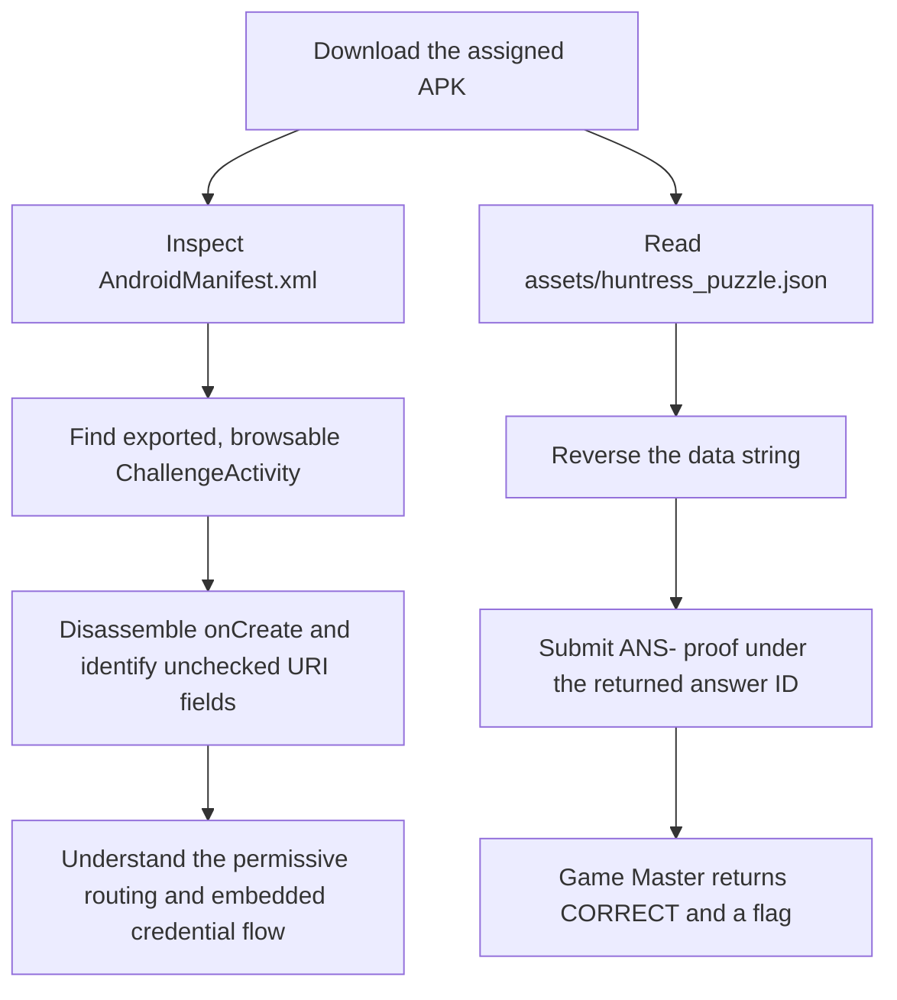

<h1 align="center">📱 Deep Link Drift</h1>
<p align="center">
  <b>Huntress CTF 2026: AI Arena Write-Up</b>
</p>
<p align="center">
  
  
  
  
</p>
<p align="center">
  Three modes, one exported Activity, and a proof string reversed from each APK
</p>

---

# 📋 Environment

| Item | Value |
| ---- | ----- |
| Event | Huntress CTF 2026: AI Arena |
| Category | Mobile |
| Author | John Hammond, and Just Hacking Training |
| Points | 2 Single Solve · 3 Time Trial · 5 Mastery |
| Challenge | `mobile-android-day-02-deep-link-drift` |
| Task | Analyze the APK, identify the permissive exported deep link, and submit the backend answer code for each assigned case |
| Tools Used | Game Master proxy, `curl`, `aapt`, `unzip`, Python `zipfile`, Androguard |

---

# 🗺️ Overview

The APK exposes a browsable `ChallengeActivity` through a custom URI scheme. Its manifest filter advertises a scheme, host, and path, but the Activity does not validate those URI components. It only checks that `answer` and `case_id` are present, then places them into a backend request with a client credential embedded in the app.

The APK also contains `assets/huntress_puzzle.json`. Its `data` value is the answer code written backwards. Reversing that field produces the exact `ANS-` code accepted for the assigned case. The codes were submitted under the answer IDs returned for each mode, and the Game Master returned `CORRECT` for all three.

---

# 📑 Table of Contents

1. [Challenge and Assignment](#challenge-and-assignment)
2. [APK Analysis](#apk-analysis)
3. [Single Solve](#single-solve)
4. [Time Trial](#time-trial)
5. [Mastery](#mastery)
6. [🚩 Submitted Answers and Flags](#-submitted-answers-and-flags)
7. [Solution Summary](#solution-summary)
8. [Lessons and Takeaways](#lessons-and-takeaways)

---

# Challenge and Assignment

The challenge prompt is:

> Day 1 taught you the roads. Now learn which ones are actually guarded — tell verified routing apart from a scheme and host that wave everybody through.

Each mode asks for the exact backend answer code for its case. The required format is `ANS-` followed by exactly 16 uppercase hexadecimal characters, with no spaces or explanatory text.

The complete question for each assigned case follows this form:

> For case **[case reference]** in package **[package name]**: Day 1 taught you the roads. Now learn which ones are actually guarded — tell verified routing apart from a scheme and host that wave everybody through. Submit only the exact backend answer code returned for this case.

| Mode | Case reference | Package | Answer ID | Timer |
| ---- | -------------- | ------- | --------- | ----- |
| Single Solve | `MOB-02-15B6E1B835` | `com.huntress.mobile.d02.v15b6e1b8356f` | `answer` | None |
| Time Trial | `MOB-02-7961FE2922` | `com.huntress.mobile.d02.v7961fe2922d9` | `answer` | Deadline: 2026-10-03 23:58:30.265 UTC |
| Mastery, set 1 | `MOB-02-285188CF6B` | `com.huntress.mobile.d02.v285188cf6b2f` | `set1.answer` | Mastery retry deadline: 2026-10-03 23:59:06.255 UTC |
| Mastery, set 2 | `MOB-02-5144692789` | `com.huntress.mobile.d02.v5144692789a5` | `set2.answer` | Same Mastery deadline |
| Mastery, set 3 | `MOB-02-47421FF0E6` | `com.huntress.mobile.d02.v47421ff0e68e` | `set3.answer` | Same Mastery deadline |

---

# APK Analysis

The Single Solve package is `com.huntress.mobile.d02.v15b6e1b8356f`. `aapt dump xmltree` shows that `.ChallengeActivity` is exported and has a `VIEW` / `DEFAULT` / `BROWSABLE` intent filter for:

```text
huntress02://deep-link-drift/unlock
```

The manifest declares `android:scheme="huntress02"`, `android:host="deep-link-drift"`, and `android:pathPrefix="/unlock"`. This is a custom-scheme deep link; it is not a verified HTTPS Android App Link. There is no `android:autoVerify` declaration or HTTPS domain association in the manifest.

Disassembling `ChallengeActivity.onCreate` shows the relevant behavior:

1. It reads `answer` and `case_id` from Intent extras.
2. If the Intent has a data URI, it replaces those values with the URI query parameters of the same names.
3. It checks only that both values are non-null. It does not compare the URI scheme, host, or path against the manifest route.
4. It appends the values to a backend evidence URL, including a client credential embedded in the APK, and loads that URL in a `WebView`.

The practical issue is that an exported component can be invoked by another app. The filter is routing metadata; it does not enforce that incoming Intents meet the declared route. The app’s own validation fails to check the route components before attaching its credential to the request.

For the Single Solve case, the route can be represented by this Android launch intent on a device with the APK installed:

```sh
adb shell am start \
  -n com.huntress.mobile.d02.v15b6e1b8356f/.ChallengeActivity \
  -a android.intent.action.VIEW \
  -d 'huntress02://deep-link-drift/unlock?case_id=MOB-02-15B6E1B835&answer=ANS-A7900B567A0EEA49'
```

The same URI shape applies to the dynamic packages, with their assigned case references and proof values.

The puzzle asset uses the `reverse` codec. For each assigned APK, extract and reverse the JSON `data` value:

```sh
unzip -p assigned.apk assets/huntress_puzzle.json
```

For example, the Single Solve asset contains:

```json
{"schema":"huntress.mobile.puzzle.v1","day":2,"codec":"reverse","data":"94AEE0A765B0097A-SNA"}
```

Reversing the `data` string gives `ANS-A7900B567A0EEA49`, which matches the required format and is accepted for the case.

---

# Single Solve

- **Artifact:** [deep_link_drift.apk](/api/huntress/game-master/download/abbe2fb2a49b4943b083e5b224d97af32025fde2a92446c295467c888c1a8a94)
- **SHA-256:** `9211e52f1844b86ef8f75622dc36df52e6e7e9935b48cf1d24ded475148cac07`
- **Case:** `MOB-02-15B6E1B835`
- **Answer ID:** `answer`
- **Timer:** None

The reversed asset value is `ANS-A7900B567A0EEA49`. It was submitted as the `answer` value for `mobile-android-day-02-deep-link-drift`. The Game Master returned `CORRECT`.

---

# Time Trial

Time Trial assigned a fresh APK and a new case.

- **Artifact:** [deep_link_drift_time_trial.apk](/api/huntress/game-master/download/13a7c0972983453d95287c6bb22125423337079167114c45a1d343153ba352c5)
- **SHA-256:** `cb6af40479cce787a74b3c4394469678383935ec1b99e1deeb5ca6e7a42d91de`
- **Case:** `MOB-02-7961FE2922`
- **Answer ID:** `answer`
- **Deadline:** 2026-10-03 23:58:30.265 UTC

The assigned asset contained `44466DC53283AEC9-SNA`. Reversing it produced `ANS-9CEA38235CD66444`. It was submitted before the deadline, and the Game Master returned `CORRECT`.

---

# Mastery

Mastery supplied three APKs. The first timer expired while resolving the zero-based delivery index; the Game Master retry restarted the same assigned material with a new six-second deadline. The three files below are from that successful retry.

| Artifact | SHA-256 | Case | Answer ID | Reversed proof |
| -------- | ------- | ---- | --------- | -------------- |
| [deep_link_drift_mastery_01.apk](/api/huntress/game-master/download/12f06bec1d514269b602fb52449f967fa678c34d324c411f9925734ff74a86fd) | `f07ee1d515eae77fb86a1f2026aa72f63452901a46bf3e0e738441c9c2fbddef` | `MOB-02-285188CF6B` | `set1.answer` | `ANS-356C1B6357351EA0` |
| [deep_link_drift_mastery_02.apk](/api/huntress/game-master/download/43188ccc449446d79e507e18f964be364e07409265624eb790cd484a746ecc38) | `28a747a0672c05304520faeda3eb018cbe2878401e866f930ef0d0a225666407` | `MOB-02-5144692789` | `set2.answer` | `ANS-209D252C7A375A32` |
| [deep_link_drift_mastery_03.apk](/api/huntress/game-master/download/cd8dda433462484aaefd1cb5acd2a68ba941cf2cfadf4849a3ea548c32d87998) | `22be4efbf0cf6d2a91e5a5c22f0bfdfe3a7330fd7d860ac5f04ab23bb56bea10` | `MOB-02-47421FF0E6` | `set3.answer` | `ANS-5DB30CBFEF40FAAF` |

The three proof strings were submitted together under their respective answer IDs before the retry deadline. The Game Master returned `CORRECT`.

---

# 🚩 Submitted Answers and Flags

The `ANS-` values are the submitted answers. The separate flags below were returned by the Game Master after accepting each mode.

| Mode | Submitted answer(s) | Game Master result | Returned flag |
| ---- | ------------------- | ------------------ | ------------- |
| Single Solve | `ANS-A7900B567A0EEA49` | `CORRECT` | `c446b6de5a4f650cedd533b43a01585a` |
| Time Trial | `ANS-9CEA38235CD66444` | `CORRECT` | `43a7564f24815a25dbdf17eca8198f62` |
| Mastery | `ANS-356C1B6357351EA0`, `ANS-209D252C7A375A32`, `ANS-5DB30CBFEF40FAAF` | `CORRECT` | `93161e8a4b4d5d491f2ef25a3a5b8ee9` |

These flags belong to the active assignments in this playthrough.

---

# Solution Summary



---

# Lessons and Takeaways

* **An intent filter does not validate an incoming Intent.** The exported Activity should check the URI components it relies on.
* **Custom schemes are not verified Android App Links.** Domain verification applies to HTTPS links associated with a verified domain.
* **Treat exported components as externally reachable.** Another app can invoke a browsable exported Activity.
* **Trace the data flow into privileged requests.** Here, URI parameters are carried into a backend evidence request alongside a credential embedded in the APK.
* **Decode the assigned bytes.** The answer is the reversed JSON `data` string; the exact answer ID still depends on the mode.
* **Separate proof from flag.** Submit the `ANS-` value; the Game Master returns the flag after accepting it.

---

Huntress CTF 2026: AI Arena • Deep Link Drift • Mobile • 2 / 3 / 5 pts
