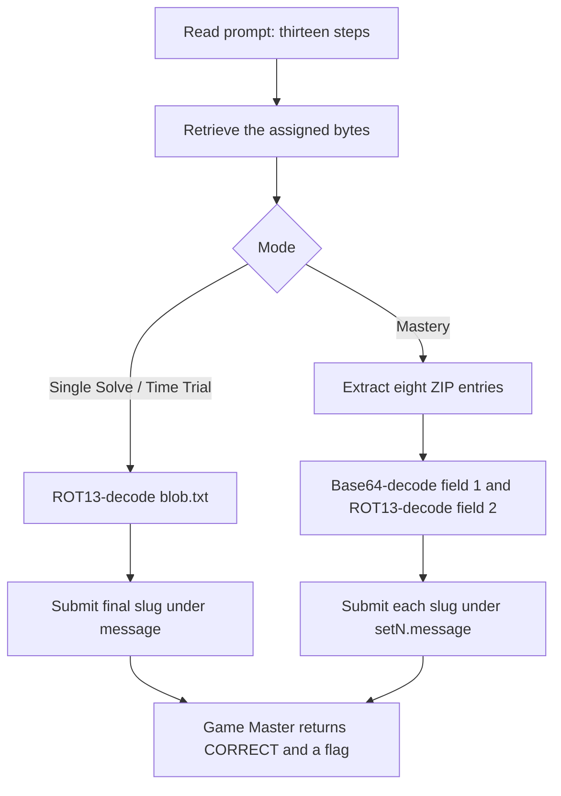

<h1 align="center">👶 Half a Turn</h1>
<p align="center">
  <b>Huntress CTF 2026: AI Arena Write-Up</b>
</p>
<p align="center">
  
  
  
  
</p>
<p align="center">
  Three modes, one ROT13 clue, and eight mixed-encoding mastery entries
</p>

---

# 📋 Environment

| Item       | Value |
| ---------- | ----- |
| Event      | Huntress CTF 2026: AI Arena |
| Category   | Warmups |
| Difficulty | Intro |
| Author     | John Hammond, and Just Hacking Training |
| Points     | 2 Single Solve · 3 Time Trial · 5 Mastery |
| Challenge  | `warmups-day-02` |
| Task       | Decode each assigned blob and submit the slug on its final decoded line |
| Tools Used | Game Master proxy, Python, `hashlib`, `zipfile`, `base64`, `tr` |

---

# 🗺️ Overview

The prompt is:

> Thirteen steps forward. Funny how that works out.

Thirteen steps forward points to ROT13. Single Solve and Time Trial each assign one text blob encoded with ROT13. Mastery assigns a ZIP with eight entries; each entry splits its message across a Base64 field and a ROT13 field. Decoding both fields and joining them reveals the same instruction format and a slug to submit.

All three modes were submitted to the Game Master and returned `CORRECT`. The Time Trial submission took **0.981 seconds** locally from the start request through the accepted response. Mastery’s eight answers were accepted within its displayed **under 8 seconds** target.

---

# 📑 Table of Contents

1. [Reading the Prompt](#reading-the-prompt)
2. [Retrieving the Assignments](#retrieving-the-assignments)
3. [Single Solve](#single-solve)
4. [Time Trial](#time-trial)
5. [Mastery](#mastery)
6. [Submitted Answers and Flags](#-submitted-answers-and-flags)
7. [Solution Summary](#solution-summary)
8. [Lessons and Takeaways](#lessons-and-takeaways)

---

# Reading the Prompt

“Thirteen steps forward” is a ROT13 hint. The Game Master question asks for the exact slug on the final non-empty decoded line. The required answer format is three lowercase words separated by hyphens, followed by a hyphen and a two-digit number; submit only that slug.

| Mode | Challenge ID | Assignment |
| ---- | ------------ | ---------- |
| Single Solve | `warmups-day-02` | One static `blob.txt` |
| Time Trial | `warmups-day-02/time_trial` | One fresh `blob.txt`; displayed target is under 1 second |
| Mastery | `warmups-day-02/mastery` | Eight blobs in a ZIP; displayed target is under 8 seconds |

---

# Retrieving the Assignments

The Game Master proxy assigned the files and supplied their SHA-256 hashes and root-relative download links. The downloaded bytes were saved and analyzed directly.

For example, retrieve the Single Solve artifact with:

```sh
curl -sS \
  'http://10.0.0.219/huntress-ctf-proxy?op=artifact&challenge=warmups-day-02' \
  -o blob.txt
sha256sum blob.txt
```

The Time Trial uses its `/time_trial` challenge ID. Mastery returns one bundle; request its first delivery with `delivery=0`.

---

# Single Solve

- **Artifact:** [blob.txt](/api/huntress/game-master/download/f1bee6df97764b55b839f031ae95707e0b4d00f8dcbe4446abe712fa4fd58eb3)
- **SHA-256:** `0698182543e3a96a86452235b5ae4479c097aa994079b98e9306547627520c7c`
- **Answer ID:** `message`
- **Timer:** None

Decode the downloaded text with ROT13:

```sh
tr 'A-Za-z' 'N-ZA-Mn-za-m' < blob.txt
```

The decoded instruction ends with `plucky-clock-flint-94`. It was submitted as `message` for `warmups-day-02`; the Game Master returned `CORRECT`.

---

# Time Trial

The Time Trial assigned a fresh `blob.txt`. Its server deadline was **2026-10-02 13:08:18.484 UTC**.

- **Artifact:** [blob.txt](/api/huntress/game-master/download/68147f011a5e4e6fbea7d0ca980af9f4b1946872dfd0484a920e377a7a8dc4ff)
- **SHA-256:** `f8018b4f1aea09d125d1c9b9a7af3bbd2e7f90e5edb944679720b96535fa6ca5`
- **Answer ID:** `message`
- **Local start-to-accepted-response time:** 0.981 seconds

ROT13 decoding revealed `jazzy-garden-dune-29`. It was submitted under `message` for `warmups-day-02/time_trial` before the deadline, and the Game Master returned `CORRECT`.

---

# Mastery

Mastery assigned eight questions and a ZIP bundle.

- **Artifact:** [warmups-day-02-mastery.zip](/api/huntress/game-master/download/78caf33ecc6343288780d0dafa406c66bde7b7ef32bf46d691c7cd0ffabc56f7)
- **SHA-256:** `91c67c329d4ade0309bdc63ffec654df16820ac56e70971cb1be3e547a043478`
- **Deadline:** 2026-10-02 13:08:29.758 UTC
- **Answer IDs:** `set1.message` through `set8.message`

Each ZIP entry has two numbered, tab-separated fields. Decode the first field as Base64 and the second as ROT13, then join the decoded text. For example:

```sh
unzip -p mastery.zip 'blob-01.txt' | awk -F '\t' 'NR == 1 {print $2}' | base64 -d
unzip -p mastery.zip 'blob-01.txt' | awk -F '\t' 'NR == 2 {print $2}' | tr 'A-Za-z' 'N-ZA-Mn-za-m'
```

The combined instruction ends with the answer slug. Repeating this for all eight entries produced:

| File | Answer ID | Answer | SHA-256 |
| ---- | --------- | ------ | ------- |
| `blob-01.txt` | `set1.message` | `nimble-chimney-flint-30` | `0cb8517cd3e68fce1f3f100f69cd937de9b3397dca8f10c583f5ae75fc9ad73c` |
| `blob-02.txt` | `set2.message` | `witty-anchor-cider-31` | `0f87d9413c999ca41dee51c7a45a44472b9ce8298862b3a80ba007c6c6a383b0` |
| `blob-03.txt` | `set3.message` | `brave-squirrel-birch-17` | `392548f719120f169f0986752786f4908bc93ac7fe522f6e0cf064f70941ab70` |
| `blob-04.txt` | `set4.message` | `snappy-tent-fern-47` | `b5764fedb6ba02d84db8c3f7980f069f9afbe2b3aaed9d1fa48a37494570cf9c` |
| `blob-05.txt` | `set5.message` | `handy-squirrel-boulder-93` | `f0ad55ad11bdce5b5a0ca251d3b37937c92ba2fc04ee7259f52c5672d5cfc240` |
| `blob-06.txt` | `set6.message` | `quiet-squirrel-brook-44` | `35132aaa341b1ec2cc6c43f556fe9b903859c1c3d645e91429de02ef3720bda5` |
| `blob-07.txt` | `set7.message` | `crisp-cloud-maple-29` | `3276e3471836de96950beb048a76a2c5032245369db8896846fd44217ce73fac` |
| `blob-08.txt` | `set8.message` | `lucky-sparrow-trail-88` | `0ca53caba62753deee5ddee9278627b894b014f3bef701adec2bfef00b8e52d0` |

All eight slugs were submitted together for `warmups-day-02/mastery`. The Game Master returned `CORRECT`.

---

# 🚩 Submitted Answers and Flags

The slugs below were the submitted answers. Each separate flag was returned by the Game Master after accepting its mode.

| Mode | Result | Returned flag |
| ---- | ------ | ------------- |
| Single Solve | `CORRECT` | `951bd7e6244bbed6a0a541ead295300b` |
| Time Trial | `CORRECT` | `67522b2b821095e4b63364de8b2e557d` |
| Mastery | `CORRECT` | `281de198f0bf6688caedb203e33cd1ef` |

---

# Solution Summary



---

# Lessons and Takeaways

* **Use the prompt as an encoding clue.** Thirteen steps identifies ROT13.
* **Inspect the full artifact structure.** Mastery uses a different encoding for each numbered field.
* **Keep answer IDs exact.** The eight Mastery slugs each belong to their own `setN.message` field.
* **Hash the assigned files.** The recorded SHA-256 values tie each result to the bytes received from the Game Master.
* **Answers and flags are different values.** Submit the decoded slug; record the returned flag separately.

---

Huntress CTF 2026: AI Arena • Half a Turn • Warmups • 2 / 3 / 5 pts
