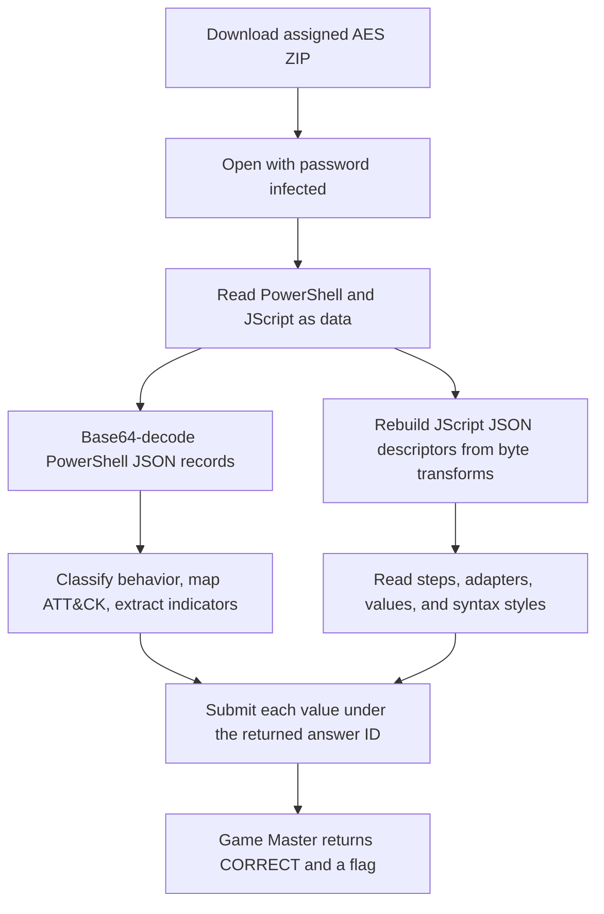

<h1 align="center">📜 Host With the Most</h1>
<p align="center">
  <b>Huntress CTF 2026: AI Arena Write-Up</b>
</p>
<p align="center">
  
  
  
</p>
<p align="center">
  Twelve inert scripts, reconstructed behavior graphs, and three accepted modes
</p>

---

# 📋 Environment

| Item       | Value |
| ---------- | ----- |
| Event      | Huntress CTF 2026: AI Arena |
| Category   | Script Analysis |
| Author     | John Hammond, and Just Hacking Training |
| Points     | 2 Single Solve · 3 Time Trial · 5 Mastery |
| Challenge  | `script-analysis-day-02-encoded-intent` |
| Task       | Classify PowerShell and JScript specimens, map their primary ATT&CK techniques, extract indicators, and distinguish JavaScript syntax forms |
| Tools Used | Game Master proxy, Python, `pyzipper`, `base64`, `json`, regular expressions, SHA-256 |

---

# 🗺️ Overview

The prompt says:

> Windows Script Host has JScript plans for execution, download, upload, and impact. Carry your PowerShell findings forward, tell a function call from an invocation or a property access, and work out which script hands off to which.

The archive contains three PowerShell samples and nine JScript samples. The PowerShell files hold Base64 JSON records. The JScript files reconstruct JSON plans using static byte arrays or packed strings, reversible XOR/shift/reversal steps, and Base64 or hex decoding. Reading and transforming those bytes as data reveals each plan without executing the scripts.

The primary behavior mappings validated by the Game Master were:

| Behavior | Scenario / role | Primary ATT&CK ID |
| -------- | --------------- | ----------------- |
| Resource hijacking | `resource_hijacking` | T1496 |
| Browser credential collection | `synthetic_collection` | T1555.003 |
| Data encryption impact | `synthetic_impact` | T1486 |
| Remote acquisition | `stager` / `downloader` | T1105 |
| Embedded decode and file write | `dropper` | T1140 |
| Windows Script Host process execution | `launcher` | T1059.007 |
| Script handoff chain | `staged_chain` | T1059.007 |
| Outbound transfer | `uploader` | T1041 |
| Benign configuration inspection | `benign_utility` | `none` |

The script handoffs are `staged-handoff.js` → `resource-sample.ps1` and `relay-handoff.js` → `local-dispatch.js`.

All three modes returned `CORRECT`. Time Trial completed in approximately **4.45 seconds** including the accepted correction, under its displayed 5-second target. Mastery completed in **1.226 seconds**, under its 4-second target.

---

# 📑 Table of Contents

1. [Reading the Prompt](#reading-the-prompt)
2. [Static Analysis Method](#static-analysis-method)
3. [Single Solve](#single-solve)
4. [Time Trial](#time-trial)
5. [Mastery](#mastery)
6. [Submitted Answers and Flags](#-submitted-answers-and-flags)
7. [Solution Summary](#solution-summary)
8. [Lessons and Takeaways](#lessons-and-takeaways)

---

# Reading the Prompt

The Game Master asks about each PowerShell specimen’s scenario, technique, and plain-text indicators. For the JScript specimens it asks for role, technique, adapter, campaign or host identifier, and selected URL/path/extension/next-stage values. A final group of questions asks whether the `inspect` function is a declaration, anonymous expression, or named expression; whether descriptor recovery uses direct, `.call`, or `.apply` invocation; and whether descriptor properties use dot, bracket-literal, or mixed access.

The answer fields require the scenario/role enum, an ATT&CK ID or `none` where allowed, or the exact artifact-derived string. The tables below record each answer ID and accepted value. Mastery prefixes the fields with `set1.` or `set2.`.

| Mode | Challenge ID | Assignment |
| ---- | ------------ | ---------- |
| Single Solve | `script-analysis-day-02-encoded-intent` | One AES-encrypted `evidence.zip` |
| Time Trial | `script-analysis-day-02-encoded-intent/time_trial` | One fresh encrypted evidence ZIP; target under 5 seconds |
| Mastery | `script-analysis-day-02-encoded-intent/mastery` | Two encrypted evidence ZIPs in one bundle; target under 4 seconds |

---

# Static Analysis Method

The ZIP password supplied with the challenge is `infected`. These are AES-encrypted ZIPs; `pyzipper` reads them. The contents are read as bytes and never executed.

```python
import pyzipper

with pyzipper.AESZipFile("evidence.zip") as archive:
    for name in archive.namelist():
        specimen = archive.read(name, pwd=b"infected")
        print(name, len(specimen))
```

For each PowerShell specimen, locate the literal passed to `FromBase64String`, Base64-decode it, and parse the resulting JSON. Map the record fields to the indicators asked for by the Game Master.

For each JScript specimen, inspect its `recover` and `decode` functions. Reconstruct the numeric byte array or packed string, apply the simple transform written in the source (for example XOR, addition/subtraction, reversal, or Base64 decoding), then parse the resulting JSON descriptor. The `steps`, `adapter`, and `values` fields expose the behavior graph and indicators. The `inspect` source itself provides the function, invocation, and property-access styles. No script execution is needed.

---

# Single Solve

### Accepted answers


| File | SHA-256 | Accepted answer fields and values |
| ---- | ------- | -------------------------------- |
| `resource-sample.ps1` | `5891c65895763717fd0fa822412a47326a83d5ca8e440b0957c020b12b68a4a0` | `resource-scenario` = `resource_hijacking`<br>`resource-attack` = `T1496`<br>`resource-url` = `https://cdn-3ba3c920ba.example.invalid/616c88ea3a5f.bin`<br>`resource-wallet` = `wallet_ff34b16d4e2acecd0c7d10f989cf97e1`<br>`resource-mutex` = `Global\HuntressLab_4ec5070f0a61` |
| `collection-sample.ps1` | `1f9cc8f2566c4867d7e22c5cabf2c4d763f14ce94e8f2435bd23995b04b08a8a` | `collection-scenario` = `synthetic_collection`<br>`collection-attack` = `T1555.003`<br>`collection-url` = `https://4e4d195c47.example.invalid/bb457599b0c4.dat`<br>`collection-file` = `update-4e4d195c47.dat`<br>`collection-user-agent` = `Mozilla/5.0 HuntressLab/8.7` |
| `impact-sample.ps1` | `f2a34893eb19b01c6401b399af299d08d0688e2c2cfa972b4f25ac1db5d9ea18` | `impact-scenario` = `synthetic_impact`<br>`impact-attack` = `T1486`<br>`impact-extension` = `.locked-2fa5a`<br>`impact-note` = `RECOVERY-2fa5a6709c.txt`<br>`impact-url` = `https://cdn-2fa5a6709c.example.invalid/eb8d1b83ce31.bin` |
| `host-context.js` | `c3d4157d2022989f99894655f39641ded647c17bd1e5e3702443c764e233e764` | `jscript-benign-role` = `benign_utility`<br>`jscript-benign-attack` = `none`<br>`jscript-benign-adapter` = `Scripting.Dictionary`<br>`jscript-benign-campaign` = `campaign-e8c441b095`<br>`jscript-benign-host` = `host-e8c441b095`<br>`jscript-benign-function-style` = `anonymous_expression`<br>`jscript-benign-invocation-style` = `apply`<br>`jscript-benign-property-style` = `dot` |
| `memory-stage.js` | `df83f9a0fdce1e2f6e1862ef905a2fb6d14a4d703bb130614f272e1611fe707b` | `jscript-stager-role` = `stager`<br>`jscript-stager-attack` = `T1105`<br>`jscript-stager-adapter` = `MSXML2.XMLHTTP.6.0`<br>`jscript-stager-campaign` = `campaign-a3a04f5ced`<br>`jscript-stager-url` = `https://a3a04f5ced.example.invalid/36925272.dat`<br>`jscript-stager-function-style` = `anonymous_expression`<br>`jscript-stager-invocation-style` = `apply`<br>`jscript-stager-property-style` = `dot` |
| `embedded-write.js` | `0674034d9f4d7febf2fdae98fc52614e8f7f609e8ce64163bdb11e7608a0016d` | `jscript-dropper-role` = `dropper`<br>`jscript-dropper-attack` = `T1140`<br>`jscript-dropper-adapter` = `ADODB.Stream`<br>`jscript-dropper-campaign` = `campaign-e0aa64e87e`<br>`jscript-dropper-path` = `C:\Users\Public\HuntressLab\stage-e0aa64e87e.dat`<br>`jscript-dropper-function-style` = `anonymous_expression`<br>`jscript-dropper-invocation-style` = `call`<br>`jscript-dropper-property-style` = `dot` |
| `remote-write.js` | `d293da7d840bde8b25ef8a92d6700f72891c67d6608e979b4f0511fe74290340` | `jscript-downloader-role` = `downloader`<br>`jscript-downloader-attack` = `T1105`<br>`jscript-downloader-adapter` = `MSXML2.XMLHTTP.6.0`<br>`jscript-downloader-campaign` = `campaign-99e39528bf`<br>`jscript-downloader-url` = `https://99e39528bf.example.invalid/83c46948.dat`<br>`jscript-downloader-function-style` = `named_expression`<br>`jscript-downloader-invocation-style` = `apply`<br>`jscript-downloader-property-style` = `mixed` |
| `local-dispatch.js` | `6b5aa714661ef0367d3a32c41ac217bf2bc630547727853dc39fbd2a43204dd0` | `jscript-launcher-role` = `launcher`<br>`jscript-launcher-attack` = `T1059.007`<br>`jscript-launcher-adapter` = `regsvr32.exe`<br>`jscript-launcher-campaign` = `campaign-3f8e0c467a`<br>`jscript-launcher-path` = `C:\Users\Public\HuntressLab\stage-3f8e0c467a.dat`<br>`jscript-launcher-function-style` = `declaration`<br>`jscript-launcher-invocation-style` = `call`<br>`jscript-launcher-property-style` = `mixed` |
| `staged-handoff.js` | `c8d0540e9756055fc8b46a5228d0dec117628dadca9fc95102050a55d8c0962d` | `jscript-chain-role` = `staged_chain`<br>`jscript-chain-attack` = `T1059.007`<br>`jscript-chain-adapter` = `Microsoft.XMLHTTP`<br>`jscript-chain-campaign` = `campaign-b2e9046e6f`<br>`jscript-chain-next-stage` = `resource-sample.ps1`<br>`jscript-chain-function-style` = `anonymous_expression`<br>`jscript-chain-invocation-style` = `direct`<br>`jscript-chain-property-style` = `bracket_literal` |
| `outbound-transfer.js` | `5ef3af89e0e3105c471db4e04902bcc302523b2dc34314833196e6225c5a882b` | `jscript-uploader-role` = `uploader`<br>`jscript-uploader-attack` = `T1041`<br>`jscript-uploader-adapter` = `CertReq.exe`<br>`jscript-uploader-campaign` = `campaign-30b8616db1`<br>`jscript-uploader-url` = `https://30b8616db1.example.invalid/bc844854.dat`<br>`jscript-uploader-function-style` = `declaration`<br>`jscript-uploader-invocation-style` = `apply`<br>`jscript-uploader-property-style` = `dot` |
| `impact-plan.js` | `13e82f2b57fb99620f842cca7db78b1a12563fa1702764def49d511de79ad296` | `jscript-impact-role` = `impact`<br>`jscript-impact-attack` = `T1486`<br>`jscript-impact-adapter` = `ADODB.Stream`<br>`jscript-impact-extension` = `.locked-ee4a70e428`<br>`jscript-impact-note` = `RECOVER-ee4a70e428.txt`<br>`jscript-impact-function-style` = `declaration`<br>`jscript-impact-invocation-style` = `direct`<br>`jscript-impact-property-style` = `bracket_literal` |
| `relay-handoff.js` | `0a539c55c34ce489b8dd8e6790f395425e04cda166ca5bbc612b2e153f7ab915` | `jscript-relay-role` = `staged_chain`<br>`jscript-relay-attack` = `T1059.007`<br>`jscript-relay-adapter` = `WinHttp.WinHttpRequest.5.1`<br>`jscript-relay-campaign` = `campaign-169b97ec9a`<br>`jscript-relay-next-stage` = `local-dispatch.js`<br>`jscript-relay-function-style` = `declaration`<br>`jscript-relay-invocation-style` = `apply`<br>`jscript-relay-property-style` = `mixed` |

The Game Master returned `CORRECT`.

---

# Time Trial

The start response set a server deadline of **2026-10-02 13:36:52.848 UTC**. The assignment was downloaded, decoded, mapped to the returned answer IDs, and submitted before that deadline.

### Accepted answers


| File | SHA-256 | Accepted answer fields and values |
| ---- | ------- | -------------------------------- |
| `resource-sample.ps1` | `b6b66be4df47e76ed795d7e2db998fa811a6359ab0d71750b3ac0f3b2806dd7a` | `resource-scenario` = `resource_hijacking`<br>`resource-attack` = `T1496`<br>`resource-url` = `https://3dce6c5ad8.example.invalid/5028e20bc1a2.dat`<br>`resource-wallet` = `wallet_7d9b8c42287af65d858646395d5c925b`<br>`resource-mutex` = `Global\HuntressLab_dc8eccf4955d` |
| `collection-sample.ps1` | `c87bf7d39e1679e454e16c2bf3b85dfb1e429ebfa199db9a26010044ec10c864` | `collection-scenario` = `synthetic_collection`<br>`collection-attack` = `T1555.003`<br>`collection-url` = `https://cdn-b2ed008641.example.invalid/32ba2af3e8d8.bin`<br>`collection-file` = `update-b2ed008641.dat`<br>`collection-user-agent` = `Mozilla/5.0 HuntressLab/8.7` |
| `impact-sample.ps1` | `e8b57242b0f3a4e6331b32a6b826cf04f990fe4b1b3e65a3354b3f1f311d200a` | `impact-scenario` = `synthetic_impact`<br>`impact-attack` = `T1486`<br>`impact-extension` = `.locked-bb3ac`<br>`impact-note` = `RECOVERY-bb3ac18ac0.txt`<br>`impact-url` = `https://bb3ac18ac0.example.invalid/07d94ddcf049.dat` |
| `host-context.js` | `6020e8efc096d92f1310f9d4e062e8fc1f787751fc909722c9a826e78945ab8f` | `jscript-benign-role` = `benign_utility`<br>`jscript-benign-attack` = `none`<br>`jscript-benign-adapter` = `Scripting.Dictionary`<br>`jscript-benign-campaign` = `campaign-65c83088e1`<br>`jscript-benign-host` = `host-65c83088e1`<br>`jscript-benign-function-style` = `named_expression`<br>`jscript-benign-invocation-style` = `call`<br>`jscript-benign-property-style` = `mixed` |
| `memory-stage.js` | `92f0bba443c471cbd3d7b20ab6e7b38165f4ae1312cc98ada465867b94334844` | `jscript-stager-role` = `stager`<br>`jscript-stager-attack` = `T1105`<br>`jscript-stager-adapter` = `WinHttp.WinHttpRequest.5.1`<br>`jscript-stager-campaign` = `campaign-ad2ebcfe0a`<br>`jscript-stager-url` = `https://ad2ebcfe0a.example.invalid/16fd4a4b.dat`<br>`jscript-stager-function-style` = `named_expression`<br>`jscript-stager-invocation-style` = `apply`<br>`jscript-stager-property-style` = `mixed` |
| `embedded-write.js` | `190edd200cff5a54612227cbd7f4338faedee36f3540c676770a4b40e741fae6` | `jscript-dropper-role` = `dropper`<br>`jscript-dropper-attack` = `T1140`<br>`jscript-dropper-adapter` = `Scripting.FileSystemObject`<br>`jscript-dropper-campaign` = `campaign-a8987941e2`<br>`jscript-dropper-path` = `C:\Users\Public\HuntressLab\stage-a8987941e2.dat`<br>`jscript-dropper-function-style` = `anonymous_expression`<br>`jscript-dropper-invocation-style` = `apply`<br>`jscript-dropper-property-style` = `bracket_literal` |
| `remote-write.js` | `44de5bf93ccbbc7fce47a1de63a41f4cf27427aa05b6a49828eb42254baf421d` | `jscript-downloader-role` = `downloader`<br>`jscript-downloader-attack` = `T1105`<br>`jscript-downloader-adapter` = `WinHttp.WinHttpRequest.5.1`<br>`jscript-downloader-campaign` = `campaign-bc0ce8b449`<br>`jscript-downloader-url` = `https://bc0ce8b449.example.invalid/9c5d1c68.dat`<br>`jscript-downloader-function-style` = `anonymous_expression`<br>`jscript-downloader-invocation-style` = `apply`<br>`jscript-downloader-property-style` = `bracket_literal` |
| `local-dispatch.js` | `6b5aa714661ef0367d3a32c41ac217bf2bc630547727853dc39fbd2a43204dd0` | `jscript-launcher-role` = `launcher`<br>`jscript-launcher-attack` = `T1059.007`<br>`jscript-launcher-adapter` = `regsvr32.exe`<br>`jscript-launcher-campaign` = `campaign-3f8e0c467a`<br>`jscript-launcher-path` = `C:\Users\Public\HuntressLab\stage-3f8e0c467a.dat`<br>`jscript-launcher-function-style` = `declaration`<br>`jscript-launcher-invocation-style` = `call`<br>`jscript-launcher-property-style` = `mixed` |
| `staged-handoff.js` | `efb71990f73c65def8ebcac84ff04ea97c838800b40d22747899a9f116aff262` | `jscript-chain-role` = `staged_chain`<br>`jscript-chain-attack` = `T1059.007`<br>`jscript-chain-adapter` = `MSXML2.XMLHTTP.6.0`<br>`jscript-chain-campaign` = `campaign-8a36daefcb`<br>`jscript-chain-next-stage` = `resource-sample.ps1`<br>`jscript-chain-function-style` = `anonymous_expression`<br>`jscript-chain-invocation-style` = `call`<br>`jscript-chain-property-style` = `bracket_literal` |
| `outbound-transfer.js` | `95ed371e8fb70b1cc786d192c16d4923e53c01b200132af22e5320e25dbb7a2c` | `jscript-uploader-role` = `uploader`<br>`jscript-uploader-attack` = `T1041`<br>`jscript-uploader-adapter` = `CertReq.exe`<br>`jscript-uploader-campaign` = `campaign-4a3e4c7b45`<br>`jscript-uploader-url` = `https://4a3e4c7b45.example.invalid/1600de56.dat`<br>`jscript-uploader-function-style` = `named_expression`<br>`jscript-uploader-invocation-style` = `apply`<br>`jscript-uploader-property-style` = `bracket_literal` |
| `impact-plan.js` | `76f33f1c2faca32463cf715bae015a70a314927a9801ec6bf41313194092017a` | `jscript-impact-role` = `impact`<br>`jscript-impact-attack` = `T1486`<br>`jscript-impact-adapter` = `Scripting.FileSystemObject`<br>`jscript-impact-extension` = `.locked-47362850d1`<br>`jscript-impact-note` = `RECOVER-47362850d1.txt`<br>`jscript-impact-function-style` = `anonymous_expression`<br>`jscript-impact-invocation-style` = `apply`<br>`jscript-impact-property-style` = `bracket_literal` |
| `relay-handoff.js` | `43160179004d0d4c087d173f2a10a065e9c5437c9dabbf68c09e6e064b17229a` | `jscript-relay-role` = `staged_chain`<br>`jscript-relay-attack` = `T1059.007`<br>`jscript-relay-adapter` = `Microsoft.XMLHTTP`<br>`jscript-relay-campaign` = `campaign-15a09c0fcc`<br>`jscript-relay-next-stage` = `local-dispatch.js`<br>`jscript-relay-function-style` = `named_expression`<br>`jscript-relay-invocation-style` = `apply`<br>`jscript-relay-property-style` = `dot` |

The answer map initially had one syntax-field correction: `jscript-dropper-property-style` is `bracket_literal` because `embedded-write.js` accesses every descriptor property with bracket literals. The corrected submission returned `CORRECT`.

---

# Mastery

Mastery contains two fresh sets. The outer archive holds `evidence-01.zip` and `evidence-02.zip`; each has the same twelve specimen filenames with set-specific contents. The accepted field IDs use the set prefixes shown below.

### Set 1


| File | SHA-256 | Accepted answer fields and values |
| ---- | ------- | -------------------------------- |
| `resource-sample.ps1` | `69cc58f66e224ae57175ea9fe91e1eaafdbc552593911680ba453ba72ad01bf2` | `set1.resource-scenario` = `resource_hijacking`<br>`set1.resource-attack` = `T1496`<br>`set1.resource-url` = `https://0ba97f372d.example.invalid/eae853c7a6a9.dat`<br>`set1.resource-wallet` = `wallet_727482d58987a06b95e34824ca7d0da0`<br>`set1.resource-mutex` = `Global\HuntressLab_8d7312bbc2d3` |
| `collection-sample.ps1` | `ac96034d2d734498f11ba24ba520ad618371e457507f67d999aeaabdc4c72493` | `set1.collection-scenario` = `synthetic_collection`<br>`set1.collection-attack` = `T1555.003`<br>`set1.collection-url` = `https://200e4f8e32.example.invalid/a3defa7500c2.dat`<br>`set1.collection-file` = `update-200e4f8e32.dat`<br>`set1.collection-user-agent` = `Mozilla/5.0 HuntressLab/2.4` |
| `impact-sample.ps1` | `328350d66c5f0942c407d4ad0d5deb651c1f1837ea8c355b2d4cbb49334cc799` | `set1.impact-scenario` = `synthetic_impact`<br>`set1.impact-attack` = `T1486`<br>`set1.impact-extension` = `.locked-55c39`<br>`set1.impact-note` = `RECOVERY-55c39256be.txt`<br>`set1.impact-url` = `https://55c39256be.example.invalid/04e6a0bca33b.dat` |
| `host-context.js` | `6d6587a0a46ddf81a886b5f9b4a6f53b2c0ad54e922d6455d6e1a51db28ef8d4` | `set1.jscript-benign-role` = `benign_utility`<br>`set1.jscript-benign-attack` = `none`<br>`set1.jscript-benign-adapter` = `Scripting.FileSystemObject`<br>`set1.jscript-benign-campaign` = `campaign-e519323845`<br>`set1.jscript-benign-host` = `host-e519323845`<br>`set1.jscript-benign-function-style` = `declaration`<br>`set1.jscript-benign-invocation-style` = `direct`<br>`set1.jscript-benign-property-style` = `mixed` |
| `memory-stage.js` | `2f29ba61a3d632c476ff96ce2ea966bf539c2679ce8c0604d513827d46d4fc49` | `set1.jscript-stager-role` = `stager`<br>`set1.jscript-stager-attack` = `T1105`<br>`set1.jscript-stager-adapter` = `WinHttp.WinHttpRequest.5.1`<br>`set1.jscript-stager-campaign` = `campaign-0585b9234b`<br>`set1.jscript-stager-url` = `https://0585b9234b.example.invalid/f179d1c6.dat`<br>`set1.jscript-stager-function-style` = `declaration`<br>`set1.jscript-stager-invocation-style` = `apply`<br>`set1.jscript-stager-property-style` = `dot` |
| `embedded-write.js` | `3f3437acf5a16c91371f97230388d7dce105102662aec892b97ad192cc07d198` | `set1.jscript-dropper-role` = `dropper`<br>`set1.jscript-dropper-attack` = `T1140`<br>`set1.jscript-dropper-adapter` = `Scripting.FileSystemObject`<br>`set1.jscript-dropper-campaign` = `campaign-bef8eb2402`<br>`set1.jscript-dropper-path` = `C:\Users\Public\HuntressLab\stage-bef8eb2402.dat`<br>`set1.jscript-dropper-function-style` = `declaration`<br>`set1.jscript-dropper-invocation-style` = `direct`<br>`set1.jscript-dropper-property-style` = `mixed` |
| `remote-write.js` | `e97d52484f8a17f2f542828092fde07752cb433af92400e5a6cde0ea18184b7c` | `set1.jscript-downloader-role` = `downloader`<br>`set1.jscript-downloader-attack` = `T1105`<br>`set1.jscript-downloader-adapter` = `Microsoft.XMLHTTP`<br>`set1.jscript-downloader-campaign` = `campaign-d38c7aa4a8`<br>`set1.jscript-downloader-url` = `https://d38c7aa4a8.example.invalid/c9a168fe.dat`<br>`set1.jscript-downloader-function-style` = `declaration`<br>`set1.jscript-downloader-invocation-style` = `apply`<br>`set1.jscript-downloader-property-style` = `bracket_literal` |
| `local-dispatch.js` | `6b5aa714661ef0367d3a32c41ac217bf2bc630547727853dc39fbd2a43204dd0` | `set1.jscript-launcher-role` = `launcher`<br>`set1.jscript-launcher-attack` = `T1059.007`<br>`set1.jscript-launcher-adapter` = `regsvr32.exe`<br>`set1.jscript-launcher-campaign` = `campaign-3f8e0c467a`<br>`set1.jscript-launcher-path` = `C:\Users\Public\HuntressLab\stage-3f8e0c467a.dat`<br>`set1.jscript-launcher-function-style` = `declaration`<br>`set1.jscript-launcher-invocation-style` = `call`<br>`set1.jscript-launcher-property-style` = `mixed` |
| `staged-handoff.js` | `224d159ba117033838130d2effeec420ac94f50a702a2fe94697e8a6c8a7f08f` | `set1.jscript-chain-role` = `staged_chain`<br>`set1.jscript-chain-attack` = `T1059.007`<br>`set1.jscript-chain-adapter` = `MSXML2.XMLHTTP.6.0`<br>`set1.jscript-chain-campaign` = `campaign-72b62d943a`<br>`set1.jscript-chain-next-stage` = `resource-sample.ps1`<br>`set1.jscript-chain-function-style` = `declaration`<br>`set1.jscript-chain-invocation-style` = `call`<br>`set1.jscript-chain-property-style` = `dot` |
| `outbound-transfer.js` | `624e16a76c092eb7394b8e4b42304bda97dcdefe83be4f522a4252423401f42c` | `set1.jscript-uploader-role` = `uploader`<br>`set1.jscript-uploader-attack` = `T1041`<br>`set1.jscript-uploader-adapter` = `CertReq.exe`<br>`set1.jscript-uploader-campaign` = `campaign-c3710578b8`<br>`set1.jscript-uploader-url` = `https://c3710578b8.example.invalid/7700eec2.dat`<br>`set1.jscript-uploader-function-style` = `anonymous_expression`<br>`set1.jscript-uploader-invocation-style` = `call`<br>`set1.jscript-uploader-property-style` = `mixed` |
| `impact-plan.js` | `aa44ac149b3d8313beda8817bb3a2454b40b47297e3fc20223f0b228bffdd4f3` | `set1.jscript-impact-role` = `impact`<br>`set1.jscript-impact-attack` = `T1486`<br>`set1.jscript-impact-adapter` = `ADODB.Stream`<br>`set1.jscript-impact-extension` = `.locked-97ef911023`<br>`set1.jscript-impact-note` = `RECOVER-97ef911023.txt`<br>`set1.jscript-impact-function-style` = `anonymous_expression`<br>`set1.jscript-impact-invocation-style` = `call`<br>`set1.jscript-impact-property-style` = `dot` |
| `relay-handoff.js` | `4519638b933a754f972e71aeadc58585ff4443a428cd0710dc96035455e2ea3c` | `set1.jscript-relay-role` = `staged_chain`<br>`set1.jscript-relay-attack` = `T1059.007`<br>`set1.jscript-relay-adapter` = `MSXML2.XMLHTTP.6.0`<br>`set1.jscript-relay-campaign` = `campaign-bcb181e00a`<br>`set1.jscript-relay-next-stage` = `local-dispatch.js`<br>`set1.jscript-relay-function-style` = `anonymous_expression`<br>`set1.jscript-relay-invocation-style` = `call`<br>`set1.jscript-relay-property-style` = `mixed` |

### Set 2


| File | SHA-256 | Accepted answer fields and values |
| ---- | ------- | -------------------------------- |
| `resource-sample.ps1` | `35ff3fa234bcdbc69910c303f373223325418ab0d47d4f7caf57fd4622dfc32f` | `set2.resource-scenario` = `resource_hijacking`<br>`set2.resource-attack` = `T1496`<br>`set2.resource-url` = `https://cd25e77421.example.invalid/5777880c7f67.dat`<br>`set2.resource-wallet` = `wallet_120b76ee32d83436945938f3d36d465d`<br>`set2.resource-mutex` = `Global\HuntressLab_20b7577ab171` |
| `collection-sample.ps1` | `fa78f86a443c53e38e34a06fc20085ed2ca6e85d331a08c76d530c6fe5f4acdf` | `set2.collection-scenario` = `synthetic_collection`<br>`set2.collection-attack` = `T1555.003`<br>`set2.collection-url` = `https://cdn-0a0aafa59e.example.invalid/4876f5424dce.bin`<br>`set2.collection-file` = `update-0a0aafa59e.dat`<br>`set2.collection-user-agent` = `Mozilla/5.0 HuntressLab/0.0` |
| `impact-sample.ps1` | `9dde7b337677d92f786cb0b007a297567fbe7dc10b6a9155b97b12377380d706` | `set2.impact-scenario` = `synthetic_impact`<br>`set2.impact-attack` = `T1486`<br>`set2.impact-extension` = `.locked-5fabe`<br>`set2.impact-note` = `RECOVERY-5fabe6b312.txt`<br>`set2.impact-url` = `https://cdn-5fabe6b312.example.invalid/136bf0decc51.bin` |
| `host-context.js` | `3d0fba6ab33040b1990d95f0266579ce53e73d6b68f044016a5adda7847e5fea` | `set2.jscript-benign-role` = `benign_utility`<br>`set2.jscript-benign-attack` = `none`<br>`set2.jscript-benign-adapter` = `Scripting.FileSystemObject`<br>`set2.jscript-benign-campaign` = `campaign-6e3631e50d`<br>`set2.jscript-benign-host` = `host-6e3631e50d`<br>`set2.jscript-benign-function-style` = `anonymous_expression`<br>`set2.jscript-benign-invocation-style` = `call`<br>`set2.jscript-benign-property-style` = `dot` |
| `memory-stage.js` | `0e55cf7551e599fab77ded363dcd276e610ffc919d006af2f04480bf00b6888f` | `set2.jscript-stager-role` = `stager`<br>`set2.jscript-stager-attack` = `T1105`<br>`set2.jscript-stager-adapter` = `WinHttp.WinHttpRequest.5.1`<br>`set2.jscript-stager-campaign` = `campaign-3249c90e47`<br>`set2.jscript-stager-url` = `https://3249c90e47.example.invalid/554961e2.dat`<br>`set2.jscript-stager-function-style` = `declaration`<br>`set2.jscript-stager-invocation-style` = `call`<br>`set2.jscript-stager-property-style` = `mixed` |
| `embedded-write.js` | `0d2ca4946023ecc1582c6396d00a06b9a8009e13d94015a1a45e502876cae756` | `set2.jscript-dropper-role` = `dropper`<br>`set2.jscript-dropper-attack` = `T1140`<br>`set2.jscript-dropper-adapter` = `Scripting.FileSystemObject`<br>`set2.jscript-dropper-campaign` = `campaign-c06b83d33c`<br>`set2.jscript-dropper-path` = `C:\Users\Public\HuntressLab\stage-c06b83d33c.dat`<br>`set2.jscript-dropper-function-style` = `anonymous_expression`<br>`set2.jscript-dropper-invocation-style` = `call`<br>`set2.jscript-dropper-property-style` = `dot` |
| `remote-write.js` | `9185768c699a728e3797d28bfa9e5f18bd458023b8dfa0fb16ca0f2892513188` | `set2.jscript-downloader-role` = `downloader`<br>`set2.jscript-downloader-attack` = `T1105`<br>`set2.jscript-downloader-adapter` = `Microsoft.XMLHTTP`<br>`set2.jscript-downloader-campaign` = `campaign-9e1cb51e06`<br>`set2.jscript-downloader-url` = `https://9e1cb51e06.example.invalid/fb5aebfb.dat`<br>`set2.jscript-downloader-function-style` = `anonymous_expression`<br>`set2.jscript-downloader-invocation-style` = `call`<br>`set2.jscript-downloader-property-style` = `bracket_literal` |
| `local-dispatch.js` | `6b5aa714661ef0367d3a32c41ac217bf2bc630547727853dc39fbd2a43204dd0` | `set2.jscript-launcher-role` = `launcher`<br>`set2.jscript-launcher-attack` = `T1059.007`<br>`set2.jscript-launcher-adapter` = `regsvr32.exe`<br>`set2.jscript-launcher-campaign` = `campaign-3f8e0c467a`<br>`set2.jscript-launcher-path` = `C:\Users\Public\HuntressLab\stage-3f8e0c467a.dat`<br>`set2.jscript-launcher-function-style` = `declaration`<br>`set2.jscript-launcher-invocation-style` = `call`<br>`set2.jscript-launcher-property-style` = `mixed` |
| `staged-handoff.js` | `9ebd9c60419d12b884af199933ead27f480f96e01b90b048bee7417e7b4b9276` | `set2.jscript-chain-role` = `staged_chain`<br>`set2.jscript-chain-attack` = `T1059.007`<br>`set2.jscript-chain-adapter` = `MSXML2.XMLHTTP.6.0`<br>`set2.jscript-chain-campaign` = `campaign-d195f382ff`<br>`set2.jscript-chain-next-stage` = `resource-sample.ps1`<br>`set2.jscript-chain-function-style` = `declaration`<br>`set2.jscript-chain-invocation-style` = `apply`<br>`set2.jscript-chain-property-style` = `mixed` |
| `outbound-transfer.js` | `128aba5ece1194704ed99052c60654b18c4a78c1706f3f8603d09d1ef06019d7` | `set2.jscript-uploader-role` = `uploader`<br>`set2.jscript-uploader-attack` = `T1041`<br>`set2.jscript-uploader-adapter` = `WinHttp.WinHttpRequest.5.1`<br>`set2.jscript-uploader-campaign` = `campaign-ca39131249`<br>`set2.jscript-uploader-url` = `https://ca39131249.example.invalid/3e340933.dat`<br>`set2.jscript-uploader-function-style` = `declaration`<br>`set2.jscript-uploader-invocation-style` = `direct`<br>`set2.jscript-uploader-property-style` = `bracket_literal` |
| `impact-plan.js` | `4f17ddd83c348b3dfd7012924fd02aa1e578eb56a6a88b0ab97a63ec4f7625b8` | `set2.jscript-impact-role` = `impact`<br>`set2.jscript-impact-attack` = `T1486`<br>`set2.jscript-impact-adapter` = `Scripting.FileSystemObject`<br>`set2.jscript-impact-extension` = `.locked-87f772a45d`<br>`set2.jscript-impact-note` = `RECOVER-87f772a45d.txt`<br>`set2.jscript-impact-function-style` = `anonymous_expression`<br>`set2.jscript-impact-invocation-style` = `call`<br>`set2.jscript-impact-property-style` = `bracket_literal` |
| `relay-handoff.js` | `743d35b50330d7fd200401db37738ce6d96b623c389523682ff34cf6f3ae8a82` | `set2.jscript-relay-role` = `staged_chain`<br>`set2.jscript-relay-attack` = `T1059.007`<br>`set2.jscript-relay-adapter` = `MSXML2.XMLHTTP.6.0`<br>`set2.jscript-relay-campaign` = `campaign-cc0599fa10`<br>`set2.jscript-relay-next-stage` = `local-dispatch.js`<br>`set2.jscript-relay-function-style` = `anonymous_expression`<br>`set2.jscript-relay-invocation-style` = `apply`<br>`set2.jscript-relay-property-style` = `dot` |

All 174 answers were submitted together. The Game Master returned `CORRECT` within the displayed target.

---

# 🚩 Submitted Answers and Flags

The accepted submissions and separate returned flags were:

| Mode | Result | Returned flag |
| ---- | ------ | ------------- |
| Single Solve | `CORRECT` | `1d5366c95ca2371f9fe6110c5a4a0dd0` |
| Time Trial | `CORRECT` | `f4033f6b228b240e6c0e3334d5fd4161` |
| Mastery | `CORRECT` | `bf88a6db47d9190bc19ccc0fd349e903` |

---

# Solution Summary



---

# Lessons and Takeaways

* **Keep script content inert.** Static byte and source inspection is enough for both languages.
* **Parse encoded material in layers.** The JScript samples vary in byte packing and reversible transforms.
* **Use ordered steps to classify intent.** Acquisition, writing, dispatch, upload, and impact form distinct behavior graphs.
* **Treat syntax forms as separate evidence.** A function expression is not a function declaration; `.call` and `.apply` are invocation styles; bracket access can coexist with dot access.
* **Trace handoffs from reconstructed values.** One plan hands off to `resource-sample.ps1`; the relay plan points to `local-dispatch.js`.
* **Keep answer values separate from flags.** The Game Master accepted the field answers and returned one flag per mode.

---

Huntress CTF 2026: AI Arena • Host With the Most • Script Analysis • 2 / 3 / 5 pts
