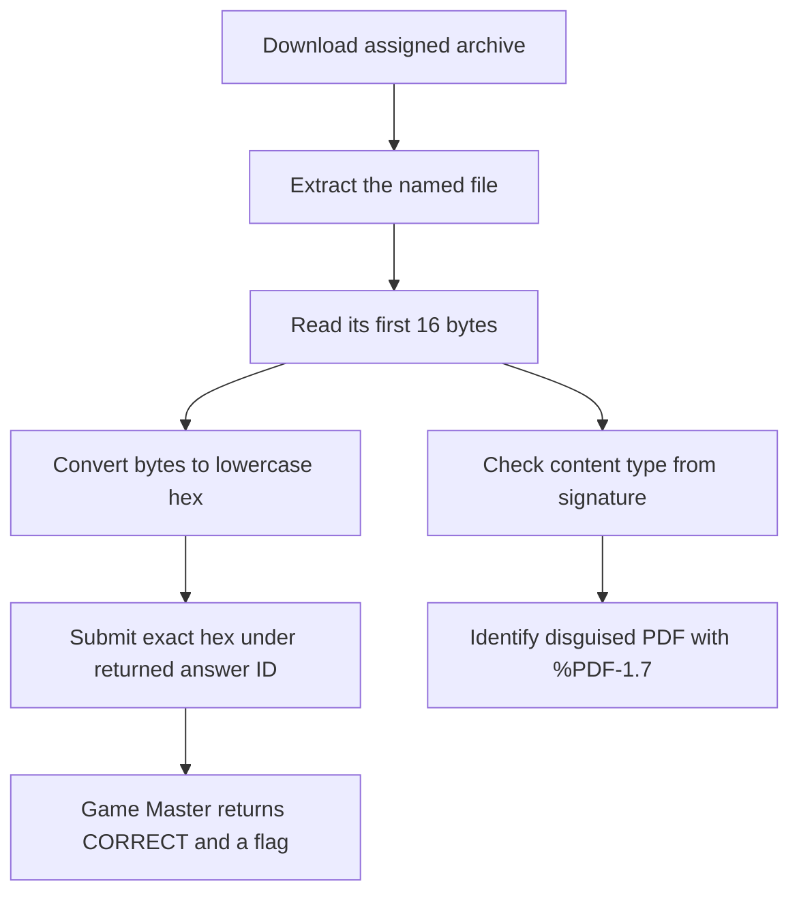

<h1 align="center">🔎 Looks Can Be Deceiving</h1>
<p align="center">
  <b>Huntress CTF 2026: AI Arena Write-Up</b>
</p>
<p align="center">
  
  
  
  
</p>
<p align="center">
  Three assignments, four specimens, and one PDF disguised by its extension
</p>

---

# 📋 Environment

| Item       | Value |
| ---------- | ----- |
| Event      | Huntress CTF 2026: AI Arena |
| Category   | Metadata Forensics |
| Difficulty | Intro |
| Author     | John Hammond, and Just Hacking Training |
| Points     | 2 Single Solve · 3 Time Trial · 5 Mastery |
| Challenge  | `metadata-forensics-day-02-looks-can-be-deceiving` |
| Task       | Identify each artifact from its bytes and submit the first 16 bytes as lowercase hex |
| Tools Used | Game Master proxy, `unzip`, `file`, `xxd`, Python, `sha256sum` |

---

# 🗺️ Overview

The prompt says:

> The extensions claim one story; the first sixteen bytes tell another. Identify what each artifact actually is and isolate the deliberate disguise.

The answer field asks for the first 16 bytes of the named file as exactly 32 lowercase hexadecimal characters. The file signature also identifies the content type:

| File | Extension suggests | First 16 bytes | Actual content |
| ---- | ------------------ | -------------- | -------------- |
| `evidence-note.txt` | Text | `48756e7472657373204d657461646174` (`Huntress Metadat`) | ASCII evidence note |
| `roster.csv` | CSV | `616e616c7973745f69642c636173655f` (`analyst_id,case_`) | CSV text |
| `evidence-note-copy.txt` | Text | `48756e7472657373204d657461646174` (`Huntress Metadat`) | ASCII evidence note |
| `disguised-report.bin` | Generic binary | `255044462d312e370a252048756e7472` (`%PDF-1.7\n% Huntr`) | PDF document, version 1.7 |

The deliberate disguise is `disguised-report.bin`: its `.bin` extension obscures a PDF signature. The `file` utility also identifies it as a PDF.

All three modes were accepted by the Game Master. The Time Trial took **0.829 seconds from artifact download through submission**; its full run, including the start request, stayed under the displayed 2-second target. Mastery’s two answers were accepted within its displayed 4-second target.

---

# 📑 Table of Contents

1. [Reading the Prompt](#reading-the-prompt)
2. [Analyzing the Artifacts](#analyzing-the-artifacts)
3. [Single Solve](#single-solve)
4. [Time Trial](#time-trial)
5. [Mastery](#mastery)
6. [Submitted Answers and Flags](#-submitted-answers-and-flags)
7. [Solution Summary](#solution-summary)
8. [Lessons and Takeaways](#lessons-and-takeaways)

---

# Reading the Prompt

The challenge uses file extensions as clues and as possible misdirection. Inspecting the first 16 bytes reveals familiar text headers and, in Mastery, a PDF header hidden behind a `.bin` suffix.

| Mode | Challenge ID | Assignment |
| ---- | ------------ | ---------- |
| Single Solve | `metadata-forensics-day-02-looks-can-be-deceiving` | One ZIP containing `evidence-note.txt` |
| Time Trial | `metadata-forensics-day-02-looks-can-be-deceiving/time_trial` | One ZIP containing `roster.csv`; displayed target is under 2 seconds |
| Mastery | `metadata-forensics-day-02-looks-can-be-deceiving/mastery` | Two nested ZIP files with two specimens; displayed target is under 4 seconds |

The answer format in each task is **32 lowercase hexadecimal characters, with no spaces or `0x` prefix**.

---

# Analyzing the Artifacts

Download the assignment through the Game Master and extract the named file. Inspect the first 16 bytes without interpreting or retyping them:

```sh
unzip -p assignment.zip evidence-note.txt | head -c 16 | xxd -p -c 16
```

For the Mastery bundle, extract the nested ZIPs first, then inspect their contents:

```sh
unzip -p mastery.zip metadata-day-02-evidence-01.zip > evidence-01.zip
unzip -p mastery.zip metadata-day-02-evidence-02.zip > evidence-02.zip
unzip -p evidence-01.zip evidence-note-copy.txt | head -c 16 | xxd -p -c 16
unzip -p evidence-02.zip disguised-report.bin | head -c 16 | xxd -p -c 16
unzip -p evidence-02.zip disguised-report.bin > disguised-report.bin
file disguised-report.bin
```

`xxd` emits the exact hex required by the answer format. `file` checks the content signature independently of the filename.

---

# Single Solve

- **Artifact:** [metadata-day-02-evidence.zip](/api/huntress/game-master/download/911f6a8f9bc04ce0b6f3698828be46d9e5d32eda38654405be2907ee78560de6)
- **SHA-256:** `c356020d0dafda86d80d000b3e3e1c0524f3a0c1a84ade856a74959047c1be67`
- **File inside:** `evidence-note.txt` — 126 bytes, ASCII text; SHA-256 `672840e4d6e79fdb346d91735916cdc6ab52abd2aa0371bc6d5eb20f65aaedd8`
- **Answer ID:** `evidence-note-magic-prefix-hex-16`
- **Timer:** None

The first 16 bytes are `Huntress Metadat`, or `48756e7472657373204d657461646174` in lowercase hex. That value was submitted and the Game Master returned `CORRECT`.

---

# Time Trial

The Time Trial assigned a new archive containing `roster.csv`.

- **Artifact:** [metadata-day-02-evidence.zip](/api/huntress/game-master/download/c9bf4eac1d1e49b08f96ba748377526bb1b9224408984d559b525adeddb52e99)
- **SHA-256:** `cb06ac9e8c8a73195752578d821dd7ce8cb83d42cf1fb123bc05e58af2a8cdfb`
- **File inside:** `roster.csv` — 82 bytes, CSV text; SHA-256 `c9f99583d9800af8ff9945904dbe0626046464f1510715db10effd3c32f1a5ee`
- **Answer ID:** `roster-magic-prefix-hex-16`
- **Deadline:** 2026-10-02 13:20:14.938 UTC
- **Download-through-submit time:** 0.829 seconds

The first 16 bytes are `analyst_id,case_`, or `616e616c7973745f69642c636173655f` in hex. The Game Master returned `CORRECT`.

---

# Mastery

Mastery supplied an outer ZIP containing two ZIP archives. Each inner archive contains one file.

- **Artifact:** [metadata-forensics-day-02-looks-can-be-deceiving-mastery.zip](/api/huntress/game-master/download/91e0ec8bee6f41dd9d3cf72bb8f5dc3e30956031be844358a072256383815056)
- **SHA-256:** `286fe65f5037df6f4b42c2404d56e50a6156ae03635349f4f81b39a474320c98`
- **Deadline:** 2026-10-02 13:20:26.081 UTC
- **Answer IDs:** `set1.evidence-note-copy-magic-prefix-hex-16` and `set2.disguised-report-magic-prefix-hex-16`

| Nested archive and file | Type from bytes | First 16 bytes as hex | File SHA-256 | Answer ID |
| ----------------------- | --------------- | -------------------- | ------------ | --------- |
| `metadata-day-02-evidence-01.zip` → `evidence-note-copy.txt` | ASCII text | `48756e7472657373204d657461646174` | `033c3aa4520d957dbf97964411082f78ce37ed957106d88e2ae5ca774c8864cd` | `set1.evidence-note-copy-magic-prefix-hex-16` |
| `metadata-day-02-evidence-02.zip` → `disguised-report.bin` | PDF 1.7 | `255044462d312e370a252048756e7472` | `bb62fbe0db033ae5cccc88054d3dde09d995223d5d9680e5fb37c4701df95cdf` | `set2.disguised-report-magic-prefix-hex-16` |

The second file starts with the PDF signature `%PDF-1.7`, making its `.bin` suffix the deliberate disguise. Both prefixes were submitted using their corresponding answer IDs, and the Game Master returned `CORRECT`.

---

# 🚩 Submitted Answers and Flags

The hex strings were the submitted answers. The separate flags below were returned after each mode was accepted.

| Mode | Result | Returned flag |
| ---- | ------ | ------------- |
| Single Solve | `CORRECT` | `9b218258ed40ee21c8e1792a33f3813a` |
| Time Trial | `CORRECT` | `6c718e3eb152c5b33447b45c692ae939` |
| Mastery | `CORRECT` | `4e7de1d40c797c0e8fe90cc2b50efa67` |

---

# Solution Summary



---

# Lessons and Takeaways

* **Extensions are labels, not proof.** Inspect the bytes to identify the actual file type.
* **Use exact byte counts.** The answer asks for the first 16 bytes, rendered as 32 lowercase hex characters.
* **Nested archives need another extraction step.** Mastery placed each specimen in its own ZIP inside the assigned bundle.
* **Record answer IDs precisely.** Mastery had two different IDs, one for each specimen.
* **Keep answers and flags separate.** The hex prefix is submitted; the Game Master returns the flag after accepting it.

---

Huntress CTF 2026: AI Arena • Looks Can Be Deceiving • Metadata Forensics • 2 / 3 / 5 pts
