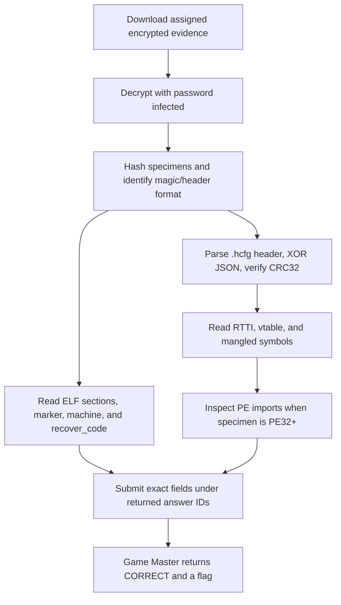

<h1 align="center">⚙️ Mangled</h1>

  <b>Huntress CTF 2026: AI Arena Write-Up</b>

  
  
  

  Three modes, two executable formats, and RTTI that reveals the class hierarchy

---

# 📋 Environment

| Item       | Value |
| ---------- | ----- |
| Event      | Huntress CTF 2026: AI Arena |
| Category   | Binary Reverse Engineering |
| Author     | John Hammond, and Just Hacking Training |
| Points     | 2 Single Solve · 3 Time Trial · 5 Mastery |
| Challenge  | `binary-reverse-engineering-day-02-cpp-and-pe-orientation` |
| Task       | Identify executable formats, recover ELF metadata and C++ config values, demangle symbols, inspect RTTI/vtables, and examine PE imports |
| Tools Used | Game Master proxy, `pyzipper`, `sha256sum`, `file`, `readelf`, `nm`, `c++filt`, `objdump`, Python `zlib` |

---

# 🗺️ Overview

The prompt describes Windows C++ and PE imports, but executable labels are only clues. The Single Solve and the accepted Time Trial specimens are ELF64. The Mastery bundle includes both a PE32+ specimen and an ELF64 specimen. Reading each file's magic and headers resolves the format directly.

The C specimen has a `.huntress` marker, a symbol table, and a `recover_code` function. The C++ specimen has an obfuscated `.hcfg` configuration plus RTTI and vtable symbols. The reconstructed hierarchy is `BehaviorEngine` → `DiscoveryEngine`; `DiscoveryEngine` implements `family()` and `score(char const*) const` and has virtual destructors.

All three Game Master modes returned `CORRECT`. Time Trial completed in about **1.6 seconds**. Mastery completed in about **2 seconds**, within the displayed 5-second target.

---

# 📑 Table of Contents

1. [Reading the Prompt](#reading-the-prompt)
2. [Static Analysis Method](#static-analysis-method)
3. [Single Solve](#single-solve)
4. [Time Trial](#time-trial)
5. [Mastery](#mastery)
6. [Submitted Answers and Flags](#-submitted-answers-and-flags)
7. [Solution Summary](#solution-summary)
8. [Lessons and Takeaways](#lessons-and-takeaways)

---

# Reading the Prompt

The task has two specimen families. The C ELF asks for its SHA-256, marker, symbol-table presence, return code, and machine. The C++ specimen asks for its hash and format, the `.hcfg` XOR key and CRC32, configuration indicators, presence of RTTI/vtable data, and exact score/vtable symbols. Mastery repeats those fields for two separately delivered evidence ZIPs. The exact field names and values submitted are shown in the mode tables below.

The evidence archives use the supplied password `infected`. Files were extracted as bytes and analyzed statically; neither ELF nor PE specimen was run.

| Mode | Assignment |
| ---- | ---------- |
| Single Solve | One encrypted `evidence.zip` containing a C ELF and a C++ ELF |
| Time Trial | One fresh encrypted `evidence.zip`; displayed target under 5 seconds |
| Mastery | Two evidence deliveries, each containing one C specimen and one C++ specimen; displayed target under 5 seconds |

---

# Static Analysis Method

Decrypt the supplied ZIP and hash each contained executable. `file` and `readelf -h -S` identify the actual formats, machine, and section table. The C sample's `.huntress` section contains its marker; disassembling `recover_code` shows `mov eax, 0x1fa4; ret`, or decimal **8100**, in the Single Solve sample.

The `.hcfg` header contains the `HCFG` magic, version, one-byte XOR key, payload length, and little-endian CRC32. XOR the payload bytes after the 12-byte header with the key; parse the resulting JSON and calculate CRC32 over those decoded JSON bytes. This recovers campaign, domain, URL, and mutex without executing the binary.

`nm`/`objdump` expose the mangled C++ symbols. `c++filt` translates `_ZNK15DiscoveryEngine5scoreEPKc` to `DiscoveryEngine::score(char const*) const`. The RTTI symbols identify `BehaviorEngine` as the base and `DiscoveryEngine` as its derived implementation. For the PE specimen, the accepted symbol values include their COFF section names (`.text$...` and `.rdata$...`); the ELF answer uses the raw Itanium symbols.

The Mastery PE specimen imports from `KERNEL32.dll` and `msvcrt.dll`. Examples include `VirtualProtect`, `VirtualQuery`, `Sleep`, `GetLastError`, and the C runtime's `getenv`, `strcmp`, `malloc`, `free`, and `memcpy`.

---

# Single Solve

Archive: [evidence.zip](/api/huntress/game-master/download/37977e5c668844b281406f10cd6d40eb480f9658b1db4800b76eab582c28086c) · SHA-256 `7c4e11a97d97bda53d42ec4ea8ed096fec210454daaaf24f29329c5b9a418a13` · password `infected`.

### Accepted answers

| Specimen | SHA-256 | Accepted answer fields and values |
| -------- | ------- | -------------------------------- |
| `day01-c.elf` | `a0d3aeddb90dccf579e0262704dc7d7c2828121d8cc988f085de169601737b9b` | `c_sha256` = `a0d3aeddb90dccf579e0262704dc7d7c2828121d8cc988f085de169601737b9b` `c_marker` = `BR01-CATALOG-000` `c_has_symtab` = `true` `c_recover_code` = `8100` `c_machine` = `x86-64` |
| `day02-cpp.elf` | `e9ca3054b0689f60a9c41a758781fae1406e127e5bfcc866c51f78748fdfd0d7` | `cpp_sha256` = `e9ca3054b0689f60a9c41a758781fae1406e127e5bfcc866c51f78748fdfd0d7` `cpp_format` = `elf` `cpp_xor_key` = `0x31` `cpp_config_crc32` = `0x6149aa00` `campaign` = `BR02-000` `domain` = `node-000.day02.example.invalid` `url` = `https://node-000.day02.example.invalid/api/BR02-000` `mutex` = `Global\HuntressBR02_000` `has_cpp_vtable` = `true` `has_cpp_typeinfo` = `true` `mangled_score_symbol` = `_ZNK15DiscoveryEngine5scoreEPKc` `vtable_symbol` = `_ZTV15DiscoveryEngine` |

The Game Master returned `CORRECT`.

---

# Time Trial

The accepted fresh assignment started at **2026-10-02 19:51:40.384 UTC** and had a server deadline of **2026-10-02 19:51:45.384 UTC**. The artifact was analyzed and submitted in about **1.6 seconds**.

Archive: [evidence.zip](/api/huntress/game-master/download/455377eb4da84fab9831c8b5f67f21a97d30c1f9dea447d6a955d9012b87dfb8) · SHA-256 `5f95c28e38b2108193b4a94ec1b78fa84d6a9c59056f5a9acc6a49ee79a5fd3a` · password `infected`.

### Accepted answers

| Specimen | SHA-256 | Accepted answer fields and values |
| -------- | ------- | -------------------------------- |
| `day01-c.elf` | `a0d3aeddb90dccf579e0262704dc7d7c2828121d8cc988f085de169601737b9b` | `c_sha256` = `a0d3aeddb90dccf579e0262704dc7d7c2828121d8cc988f085de169601737b9b` `c_marker` = `BR01-CATALOG-000` `c_has_symtab` = `true` `c_recover_code` = `8100` `c_machine` = `x86-64` |
| `day02-cpp.elf` | `3fcf8f637cea918821000c09fc011e15615302270de70a4ceb6937965e13dfdf` | `cpp_sha256` = `3fcf8f637cea918821000c09fc011e15615302270de70a4ceb6937965e13dfdf` `cpp_format` = `elf` `cpp_xor_key` = `0x35` `cpp_config_crc32` = `0x7687a63b` `campaign` = `BR02-004` `domain` = `node-004.day02.example.invalid` `url` = `https://node-004.day02.example.invalid/api/BR02-004` `mutex` = `Global\HuntressBR02_004` `has_cpp_vtable` = `true` `has_cpp_typeinfo` = `true` `mangled_score_symbol` = `_ZNK15DiscoveryEngine5scoreEPKc` `vtable_symbol` = `_ZTV15DiscoveryEngine` |

The Game Master returned `CORRECT`.

---

# Mastery

Mastery supplied two `evidence.zip` deliveries. Their capabilities and archive hashes came from the accepted assignment's start response:

| Set | Download | SHA-256 | Password |
| --- | -------- | ------- | -------- |
| Set 1 | [evidence.zip](/api/huntress/game-master/download/5071c48212d24ed69f9dd219a4c0f63b8856719fe5ad42dd8e044d807c38ae14) | `8c78c4eaa6235a25e4b3f033b6e5d562c0d321889fd0a4459be723158479d1ca` | `infected` |
| Set 2 | [evidence.zip](/api/huntress/game-master/download/3e97d1a942584f65b9df373c920e752c82d0489210164d4aacc6419ec00d7ac7) | `38eec088de545fa0cfdd81f57fbf362995bbd3829e353f167e167b01f0b19af6` | `infected` |

The accepted assignment started at **2026-10-02 19:52:04.913 UTC** with a server deadline of **2026-10-02 19:52:16.913 UTC**. The two deliveries were parsed and their answers were submitted together in about **2 seconds**, within the displayed 5-second target.

### Set 1 — accepted answers

| Specimen | SHA-256 | Accepted answer fields and values |
| -------- | ------- | -------------------------------- |
| `day01-c.elf` | `a0d3aeddb90dccf579e0262704dc7d7c2828121d8cc988f085de169601737b9b` | `set1.c_sha256` = `a0d3aeddb90dccf579e0262704dc7d7c2828121d8cc988f085de169601737b9b` `set1.c_marker` = `BR01-CATALOG-000` `set1.c_has_symtab` = `true` `set1.c_recover_code` = `8100` `set1.c_machine` = `x86-64` |
| `day02-cpp.exe` | `1db6cd34482281e61ef34dd5695745b9370549e63a5241afbc7c5f9bda911cfc` | `set1.cpp_sha256` = `1db6cd34482281e61ef34dd5695745b9370549e63a5241afbc7c5f9bda911cfc` `set1.cpp_format` = `pe` `set1.cpp_xor_key` = `0x32` `set1.cpp_config_crc32` = `0xffdeebbe` `set1.campaign` = `BR02-001` `set1.domain` = `node-001.day02.example.invalid` `set1.url` = `https://node-001.day02.example.invalid/api/BR02-001` `set1.mutex` = `Global\HuntressBR02_001` `set1.has_cpp_vtable` = `true` `set1.has_cpp_typeinfo` = `true` `set1.mangled_score_symbol` = `.text$_ZNK15DiscoveryEngine5scoreEPKc` `set1.vtable_symbol` = `.rdata$_ZTV15DiscoveryEngine` |

### Set 2 — accepted answers

| Specimen | SHA-256 | Accepted answer fields and values |
| -------- | ------- | -------------------------------- |
| `day01-c.elf` | `d8264282020a355392255d09ce5a995970044dd7322cbe28018d246f11c3ba8d` | `set2.c_sha256` = `d8264282020a355392255d09ce5a995970044dd7322cbe28018d246f11c3ba8d` `set2.c_marker` = `BR01-CATALOG-013` `set2.c_has_symtab` = `true` `set2.c_recover_code` = `8113` `set2.c_machine` = `x86-64` |
| `day02-cpp.elf` | `a133311c7526c803be7ba2aa5b50e692a7e5d54bb12ef1e56a75fdc9c1eea1d2` | `set2.cpp_sha256` = `a133311c7526c803be7ba2aa5b50e692a7e5d54bb12ef1e56a75fdc9c1eea1d2` `set2.cpp_format` = `elf` `set2.cpp_xor_key` = `0x32` `set2.cpp_config_crc32` = `0xffdeebbe` `set2.campaign` = `BR02-001` `set2.domain` = `node-001.day02.example.invalid` `set2.url` = `https://node-001.day02.example.invalid/api/BR02-001` `set2.mutex` = `Global\HuntressBR02_001` `set2.has_cpp_vtable` = `true` `set2.has_cpp_typeinfo` = `true` `set2.mangled_score_symbol` = `_ZNK15DiscoveryEngine5scoreEPKc` `set2.vtable_symbol` = `_ZTV15DiscoveryEngine` |

The Game Master returned `CORRECT`.

---

# 🚩 Submitted Answers and Flags

| Mode | Result | Returned flag |
| ---- | ------ | ------------- |
| Single Solve | `CORRECT` | `0c643c5e7037cb3c91f9c8222d54cf12` |
| Time Trial | `CORRECT` | `5afa8499849867e1e7c2070836090f46` |
| Mastery | `CORRECT` | `a9bc4828190541e922fa657712686680` |

---

# Solution Summary

---

# Lessons and Takeaways

* **Trust the bytes over a platform hint.** The downloaded sets include both ELF and PE formats, despite the prompt emphasizing Windows.
* **Use RTTI to infer relationships.** The typeinfo for `DiscoveryEngine` refers to `BehaviorEngine`, revealing the inheritance chain.
* **Separate demangling from exact submission.** `c++filt` explains a symbol; the answer field may still require its exact raw or section-qualified spelling.
* **Treat `.hcfg` as data.** The header gives the key, length, and CRC; a one-byte XOR reveals the JSON without running the executable.
* **Inspect PE imports directly.** The PE variant imports Windows APIs from `KERNEL32.dll` and C runtime functions from `msvcrt.dll`.
* **Keep answers distinct from flags.** The field values solve the questions; the Game Master returns one flag per accepted mode.

---

Huntress CTF 2026: AI Arena • Mangled • Binary Reverse Engineering • 2 / 3 / 5 pts
