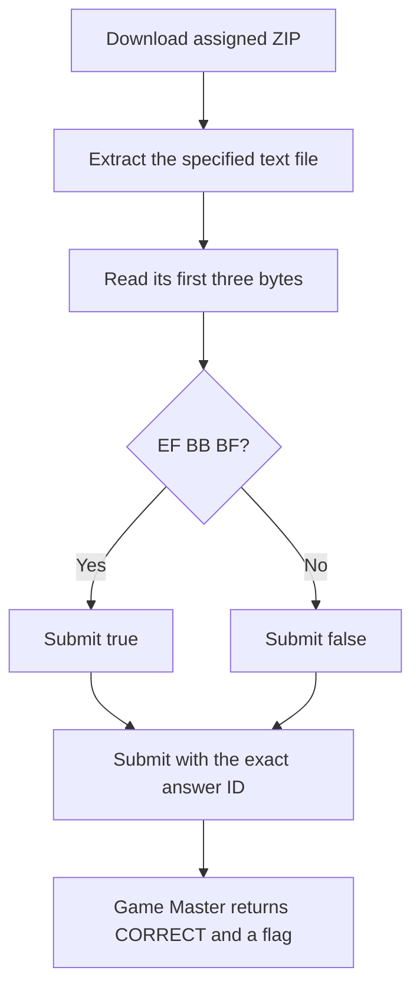

<h1 align="center">🔎 BOM Voyage</h1>
<p align="center">
  <b>Huntress CTF 2026: AI Arena Write-Up</b>
</p>
<p align="center">
  
  
  
  
</p>
<p align="center">
  Three modes, four text files, and one three-byte prefix check
</p>

---

# 📋 Environment

| Item | Value |
| ---- | ----- |
| Event | Huntress CTF 2026: AI Arena |
| Category | Metadata Forensics |
| Author | John Hammond, and Just Hacking Training |
| Points | 2 Single Solve · 3 Time Trial · 5 Mastery |
| Challenge | `metadata-forensics-day-03-bom-voyage` |
| Task | Determine whether each assigned text file begins with a UTF-8 byte order mark |
| Tools Used | Game Master proxy, `curl`, `sha256sum`, `unzip`, `xxd`, Python |

---

# 🗺️ Overview

The challenge prompt is:

> A text export pipeline produced files that look identical in an editor but behave differently in scripts. Find the encoding landmines before they break the investigation.

Each question asks for the Boolean value of `text.utf8_bom_present`. A UTF-8 BOM is the byte sequence `EF BB BF` at offset zero. I inspected the extracted file bytes rather than relying on how an editor rendered the text.

The files `evidence-note.txt`, `roster.csv`, and `export-004-clean.txt` do not start with that prefix. `export-003-with-bom.txt` does. All mode submissions were accepted by the Game Master.

---

# 📑 Table of Contents

1. [Challenge and Answer Format](#challenge-and-answer-format)
2. [Inspection Method](#inspection-method)
3. [Single Solve](#single-solve)
4. [Time Trial](#time-trial)
5. [Mastery](#mastery)
6. [🚩 Submitted Answers and Flags](#-submitted-answers-and-flags)
7. [Solution Summary](#solution-summary)
8. [Lessons and Takeaways](#lessons-and-takeaways)

---

# Challenge and Answer Format

The challenge ID is `metadata-forensics-day-03-bom-voyage`. The Single Solve question is:

> Determine `text.utf8_bom_present` for `evidence-note.txt`.

Time Trial and Mastery ask the same question for their assigned filenames. The answer format is the exact string `true` or `false`; whitespace is trimmed.

| Mode | Target file | Answer ID | Successful timer |
| ---- | ----------- | --------- | ---------------- |
| Single Solve | `evidence-note.txt` | `evidence-note-text-utf8-bom-present` | Untimed |
| Time Trial | `roster.csv` | `roster-text-utf8-bom-present` | Retry started 2026-10-04 00:09:39.225 UTC; deadline 00:09:45.225 UTC |
| Mastery, set 1 | `export-003-with-bom.txt` | `set1.d03-text-003-text-utf8-bom-present` | Retry started 2026-10-04 00:12:54.973 UTC; deadline 00:12:59.973 UTC |
| Mastery, set 2 | `export-004-clean.txt` | `set2.d03-text-004-text-utf8-bom-present` | Same Mastery deadline |

---

# Inspection Method

The assigned artifacts are ZIP files. Extract the named text file and inspect its first three bytes:

```sh
unzip -p evidence.zip evidence-note.txt | xxd -g 1 -l 8
```

If the bytes start with `ef bb bf`, the answer is `true`; otherwise it is `false`.

Python can make the check directly:

```python
has_utf8_bom = data.startswith(b"\xef\xbb\xbf")
print("true" if has_utf8_bom else "false")
```

---

# Single Solve

- **Artifact:** [metadata-day-03-evidence.zip](/api/huntress/game-master/download/266d6cb2bbab4e4793087bb657225175430ad608ed7944728e4f03482243890f)
- **SHA-256:** `207c74a175c574a31325c983afa860b59477238a9d1d9e075de7cfabadf0a285`
- **Target:** `evidence-note.txt`
- **Answer ID:** `evidence-note-text-utf8-bom-present`
- **Timer:** None

The first bytes were `43 61 73 65 20 33 44 46 ...`, not `EF BB BF`. I submitted `false`. The Game Master returned `CORRECT`.

---

# Time Trial

- **Artifact:** [metadata-day-03-evidence.zip](/api/huntress/game-master/download/7caff483467e4368ba1f42e123574b60827ae331a442461b9b18c9303a004ae7)
- **SHA-256:** `941acab50c421c8f13be3e9cecde35b70398cb721fba007f991daf51ef7752bb`
- **Target:** `roster.csv`
- **Answer ID:** `roster-text-utf8-bom-present`
- **Successful retry deadline:** 2026-10-04 00:09:45.225 UTC

The CSV starts with `68 6f 73 74 2c 63 61 73` (`host,cas...`), so it has no UTF-8 BOM. I submitted `false` before the retry deadline. The Game Master returned `CORRECT`.

---

# Mastery

Mastery assigned two text files. The successful retry returned one ZIP artifact per set.

| Set | Artifact | SHA-256 | Target prefix | Answer ID | Answer |
| ---: | -------- | ------- | ------------- | --------- | ------ |
| 1 | [metadata-day-03-evidence.zip](/api/huntress/game-master/download/64c64a5f0ccc4013b0f02b8e05f02d0bafa4a37508d04ff594533a72007aa836) | `dcb908aa9f859898aede8c98e716df1b83dd390ae03bff8a9ce51a7f4cb43f2e` | `EF BB BF 45 78 70 6f 72...` | `set1.d03-text-003-text-utf8-bom-present` | `true` |
| 2 | [metadata-day-03-evidence.zip](/api/huntress/game-master/download/14e8624eba7e4f9b9193e92e7bea5b6f07836bf38c5642fdaa5e3ee412b91ad6) | `3df835f056a33476d039be8818140212670a8cd33abc6db7a10df7e5d3d50efc` | `45 78 70 6f 72 74 20 34...` | `set2.d03-text-004-text-utf8-bom-present` | `false` |

The first target, `export-003-with-bom.txt`, begins with the UTF-8 BOM. The second, `export-004-clean.txt`, does not. I submitted `true` and `false` under the corresponding answer IDs, and the Game Master returned `CORRECT`.

---

# 🚩 Submitted Answers and Flags

The Boolean values are the submitted answers. The flags are separate values returned after each mode was accepted.

| Mode | Submitted answer(s) | Game Master result | Returned flag |
| ---- | ------------------- | ------------------ | ------------- |
| Single Solve | `false` | `CORRECT` | `bff128255051e1c84e923d50273d5d43` |
| Time Trial | `false` | `CORRECT` | `6e495010495da8e76d5b84be02258be6` |
| Mastery | `true`, `false` | `CORRECT` | `f290a1ad2b988618acfd7a914c58ce23` |

These flags belong to the active assignments in this playthrough.

---

# Solution Summary



---

# Lessons and Takeaways

* **Inspect bytes, not rendered text.** Editors can hide or normalize a BOM.
* **Check offset zero.** UTF-8 BOM detection is the exact prefix check `EF BB BF`.
* **Answer every Mastery set.** Each target file has its own answer ID and Boolean result.
* **Keep the answer and flag distinct.** Submit `true` or `false`; the Game Master returns the flag after accepting it.

---

Huntress CTF 2026: AI Arena • BOM Voyage • Metadata Forensics • 2 / 3 / 5 pts
