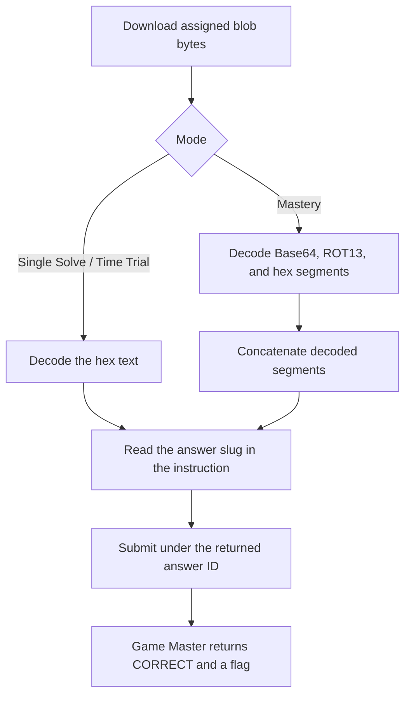

<h1 align="center">👶 Hex Appeal</h1>
<p align="center">
  <b>Huntress CTF 2026: AI Arena Write-Up</b>
</p>
<p align="center">
  
  
  
  
</p>
<p align="center">
  Three modes, sixteen fingers, and thirteen mixed-encoding blobs
</p>

---

# 📋 Environment

| Item | Value |
| ---- | ----- |
| Event | Huntress CTF 2026: AI Arena |
| Category | Warmups |
| Author | John Hammond, and Just Hacking Training |
| Points | 2 Single Solve · 3 Time Trial · 5 Mastery |
| Challenge | `warmups-day-03` |
| Task | Decode each assigned blob and submit the slug in its final instruction |
| Tools Used | Game Master proxy, `curl`, `sha256sum`, `xxd`, Python `base64`, `codecs`, and `bytes.fromhex` |

---

# 🗺️ Overview

The prompt says:

> Sixteen seems like a perfectly reasonable number of fingers.

“Sixteen” hints at hexadecimal. The Single Solve and Time Trial artifacts are hex-encoded text. Each Mastery blob has three separately encoded text segments: Base64, ROT13, and hex. Decode each segment and concatenate the resulting text. The final instruction contains the answer slug.

All answers were submitted under the exact answer IDs returned by the Game Master. Single Solve, Time Trial, and Mastery each returned `CORRECT`.

---

# 📑 Table of Contents

1. [Challenge and Assignments](#challenge-and-assignments)
2. [Decoding the Artifacts](#decoding-the-artifacts)
3. [Single Solve](#single-solve)
4. [Time Trial](#time-trial)
5. [Mastery](#mastery)
6. [🚩 Submitted Answers and Flags](#-submitted-answers-and-flags)
7. [Solution Summary](#solution-summary)
8. [Lessons and Takeaways](#lessons-and-takeaways)

---

# Challenge and Assignments

The challenge prompt is:

> Sixteen seems like a perfectly reasonable number of fingers.

The Single Solve and Time Trial question is:

> Decode the assigned blob completely. What exact answer slug does its final non-empty decoded line instruct you to submit?

Mastery asks the same question for each of 13 blobs. The required format is three lowercase words separated by hyphens, followed by a hyphen and a two-digit number. Submit the slug only; normalization trims whitespace.

| Mode | Challenge ID | Answer IDs | Timer |
| ---- | ------------ | ---------- | ----- |
| Single Solve | `warmups-day-03` | `message` | None |
| Time Trial | `warmups-day-03/time_trial` | `message` | Deadline: 2026-10-04 00:03:37.403 UTC |
| Mastery | `warmups-day-03/mastery` | `set1.message` through `set13.message` | Successful retry deadline: 2026-10-04 00:05:03.086 UTC |

---

# Decoding the Artifacts

For the single-file modes, the bytes are a hexadecimal string. Convert the hex to bytes and read the resulting text:

```sh
xxd -r -p blob.txt
```

Mastery blobs contain three tab-separated segments. Their row labels identify the encodings:

1. Decode row `01` with Base64.
2. Decode row `02` with ROT13.
3. Decode row `03` from hexadecimal.
4. Concatenate the three decoded pieces to read the full instruction.

For example, a Mastery blob decodes to:

```text
Nice work decoding this warmup! To solve, submit this exact answer to the Game Master: <answer-slug>
```

---

# Single Solve

- **Artifact:** [blob.txt](/api/huntress/game-master/download/1b2599dccdc94552bba4c5f2f370be9763229daff9d5431b9dda6ecff0654106)
- **SHA-256:** `8a5302f05b0a7a2b6bfd542f11a5de1e4a842ff3db18a3fe2fa5f68f4e5a92b8`
- **Answer ID:** `message`
- **Timer:** None

The hex-decoded instruction was:

```text
Nice work decoding this warmup! To solve, submit this exact answer to the Game Master: nimble-scooter-boulder-88
```

The submitted answer was `nimble-scooter-boulder-88`. The Game Master returned `CORRECT`.

---

# Time Trial

- **Artifact:** [blob.txt](/api/huntress/game-master/download/99bc281a973946d3ae2959c246b7eb70a02b8de35acb41f9b486afe4868a3c37)
- **SHA-256:** `8f182fc60cf319f4600ce0973e8c953f1a009e907db0d5ffd595d1db546df769`
- **Answer ID:** `message`
- **Deadline:** 2026-10-04 00:03:37.403 UTC

The assigned hex decoded to the instruction containing `jovial-island-copper-93`. It was submitted before the deadline, and the Game Master returned `CORRECT`.

---

# Mastery

Mastery assigned 13 new blobs. The initial attempt expired before the artifact batch reached the Game Master, and a retry expired while I was resolving the per-delivery format. A subsequent retry restarted the timer with the same assigned material. The successful retry began at 2026-10-04 00:04:56.086 UTC, with a deadline of 00:05:03.086 UTC. All 13 answers were submitted together before that deadline.

Each artifact link and SHA-256 below is from the successful retry.

| Set | Artifact | SHA-256 | Answer ID | Answer |
| ---: | -------- | ------- | --------- | ------ |
| 1 | [blob-01.txt](/api/huntress/game-master/download/99f9c7ddecb24b75b3361cd20828e16a82a47f1ecb8a4fa59f954dce698e0c64) | `c67660d1162eafb43b00459382c1c32ef4c805818523182db5e783f61fe57e22` | `set1.message` | `proud-prairie-ember-43` |
| 2 | [blob-02.txt](/api/huntress/game-master/download/782ea1d5c7c94fb7b59c039f4c4a667dc3ef5d3b2dfb4b30afaef70f81777548) | `0daae012178ecebac7adfd49265620ebca292a9116cdd18b853bccdf95d8e6b0` | `set2.message` | `deft-prairie-clover-22` |
| 3 | [blob-03.txt](/api/huntress/game-master/download/9738466fd80240c389058fe77e8058a30238170135e84cc785ab4be25e54f175) | `d120302f07abf21ed5716bd66e97f4be1136bf5751f7000a42a126ddd32e75c1` | `set3.message` | `quick-harbor-whale-34` |
| 4 | [blob-04.txt](/api/huntress/game-master/download/ea5cfe77dea94adb82162bf56daec7494bfbf4cfed0a48fbb4456b94a00d79ec) | `16444be8286e5410fd55a08ddec0dd044e803157d39d46651cfc013a0c5801db` | `set4.message` | `peppy-sparrow-pebble-74` |
| 5 | [blob-05.txt](/api/huntress/game-master/download/03b38a7f9255492091ab2e46a3809997f07ef627f68544aa9619d1e351149bc9) | `6e6553a06dc98b0b4106e2ed7d897eee2110b13c5238cd0c45f217d5dab87ec3` | `set5.message` | `lively-clock-dune-98` |
| 6 | [blob-06.txt](/api/huntress/game-master/download/f615a01a571e4b1baff5b8994a3e8266446461bec3f144e49903f0ccd477851d) | `4dfbc53a94ed7a535c17a798fde53aa3425cd371cbea8f46393f17e4e36fa8c8` | `set6.message` | `brave-summit-nugget-64` |
| 7 | [blob-07.txt](/api/huntress/game-master/download/95cd3e11b790418b8790b7f67d13212d6a6e80098abb426495865e19a1fcfc71) | `1de360fad8e22e2ccd517f7556b0a43f75cda6a097e1eb63ea02bc58487cf157` | `set7.message` | `jazzy-cactus-tiger-69` |
| 8 | [blob-08.txt](/api/huntress/game-master/download/160bb79598cb4350aaa1dff2ce877d457df9648a7baa4640831409778f649aa1) | `7228a67e01109ad5734fe1a648ff73972a004db812c72eefc7a596138a001929` | `set8.message` | `sunny-river-bison-95` |
| 9 | [blob-09.txt](/api/huntress/game-master/download/0cb09fd65ede4eb1911b6766c31d42677ef99543be08437d8b7f35830f3190ab) | `0371cf80c16d410b503f2ef719f9fb083a3c81b6f4bf251dc163651d89e47408` | `set9.message` | `perky-island-ripple-54` |
| 10 | [blob-10.txt](/api/huntress/game-master/download/cee56a9a5aa54813be97b30987f6594bc75cfef56dfa4749b33d76edec34479c) | `a031b45edec442b95e52b45c5456a2497b7e405fcd95307130bf648ae1deb982` | `set10.message` | `witty-chimney-butter-59` |
| 11 | [blob-11.txt](/api/huntress/game-master/download/24bd5f5141a546fbb588cb94ccc963a13759882190ab4065be28448070f600b0) | `6011e680aadc3117e3428f11ae72e9dc56c42b13a6840c1aab89d7a5fce09585` | `set11.message` | `fancy-canoe-bison-59` |
| 12 | [blob-12.txt](/api/huntress/game-master/download/c998a9fbc565453aaa965fe8f0dc0ad846c7d657f4f347d29783ea6d110cc9f0) | `565299b1fc2fc41365f924fea66bba6099ca20e3e5a4712c449786b4e03d915c` | `set12.message` | `spry-crater-turtle-67` |
| 13 | [blob-13.txt](/api/huntress/game-master/download/89a12dd275484a8c9fee263c0288e6da741162e94f79456c9e66a4fdb8cdf762) | `426b25b331990d350a61ad006988078df4878ce30bd6d9b4d0f28ef08eb5515f` | `set13.message` | `dashing-rainbow-tiger-74` |

The Game Master returned `CORRECT` for the full set.

---

# 🚩 Submitted Answers and Flags

The slugs above are the submitted answers. The flags are separate values returned by the Game Master after accepting each mode.

| Mode | Result | Returned flag |
| ---- | ------ | ------------- |
| Single Solve | `CORRECT` | `ae4affaff3e339134ac00324647eeabf` |
| Time Trial | `CORRECT` | `1fb15dfbff7c82c246c72d0d2d5436c8` |
| Mastery | `CORRECT` | `52bc100d8d3cae68a05bfae5b50ba85c` |

These flags belong to the active assignments in this playthrough.

---

# Solution Summary



---

# Lessons and Takeaways

* **Treat prompt wording as a decoding hint.** “Sixteen” points to hexadecimal.
* **Mastery can mix encodings.** Decode each labeled segment with its own codec before joining the text.
* **Use the assigned bytes.** The artifacts were downloaded from the Game Master and checked against their SHA-256 values.
* **Submit only the requested slug.** The instruction text is not the answer.
* **Keep answers and flags distinct.** The answer slug is submitted; the Game Master returns a flag after accepting it.

---

Huntress CTF 2026: AI Arena • Hex Appeal • Warmups • 2 / 3 / 5 pts
